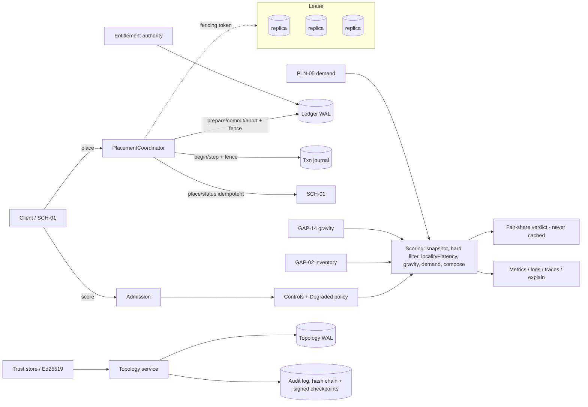

# ADR-0001 — GAP-03 topology-aware scheduler control plane

- **Status:** Proposed (NOT approved — requires engineering, SRE and security-architecture approval; see "Approvals")
- **Date:** 2026-09-22
- **Supersedes:** none. **Superseded by:** none.
- **Supersession rule:** architecture changes create ADR-000N referencing this one; this file is immutable once Accepted (edits only to the Status line).

## Context and problem

v4.2.0 shipped a correct, thread-safe, in-process locality/fair-share scorer with no durable state, identity, coordination
or adjacent integrations. It could not run as more than one process without over-claiming capacity or trusting forged
topology. Scope of this decision: the control plane that turns that algorithm into a multi-replica service.
Non-goals (unchanged from the contract): hard constraint filtering ownership, trust classification, capacity targets,
node lifecycle, data residency policy, owning the final placement decision (SCH-01 owns it).

## Decision

1. **Algorithms (unchanged core):** static region/site/rack locality classes (0/1/2/11/101), strict failure-domain spreading,
   reservation-protecting fair share with non-mutating verdict + state token. Multi-objective composition
   (`gap03-score/2`) is integer, weight-bounded, and keeps every hard gate outside the weighted sum; spreading stays
   lexicographic. Measured latency may only move a cost *within* its static class band.
2. **State:** hash-chained write-ahead log + verified snapshots per store (topology, ledger, entitlement, config, controls,
   transaction journal, explain, audit). Write ordering validate → apply-to-copy → append → fsync → acknowledge.
3. **Coordination:** single elected leader per environment; majority lease with strictly increasing fencing tokens;
   safety margin subtracted from TTL; every protected write carries the token and every participant rejects older tokens.
4. **Commit protocol:** saga over an idempotent fenced journal: BEGIN → PREPARED (ledger reservation) → COMMITTED/ABORTED,
   with UNKNOWN resolved by querying SCH-01 by transaction id.
5. **Identity/trust:** SPIFFE-style identities, Ed25519-signed credentials and artifacts, single allowed algorithm,
   nonce replay cache, fail-closed attestation for security-sensitive node classes.
6. **Operations:** degraded-mode matrix, freeze/quarantine controls, health/readiness with hysteresis, Prometheus metrics,
   JSON logs, W3C trace context, explain API with replay, alert/dashboards as code.

## Alternatives considered

| Alternative | Rejected because |
|---|---|
| Stay stateless, rely on SCH-01 for claims | SCH-01 does not own fair share; two schedulers could each approve the last slot. |
| Multi-writer with CRDT counters | Fair-share admission needs a global check-then-act; CRDTs admit overclaim under partition. |
| Consensus-backed multi-writer (Raft per shard) | Correct but heavier; deferred — the lease/fencing seam allows it later (new ADR). |
| Two-phase commit with SCH-01 as participant | Requires SCH-01 to hold locks across our crash; saga + idempotent status query is simpler. |
| HMAC shared secrets for identity | Symmetric keys let any verifier forge; Ed25519 separates signing from verifying. |

## Invariants and assumptions

- Deterministic ranking for identical immutable inputs (tie-break by node id code point).
- No placement spends another tenant's unmet reservation; used ≤ physical capacity (enforced in the durable apply).
- A process-local lock is never treated as distributed ownership.
- Clock assumption: replica clocks drift < safety margin (default 2 s of a 10 s TTL); lease replicas use their own time.
- The declared topology is the source of truth; measurement never invents an edge.

## Trade-offs

Consistency over availability for commits (fail closed on ownership/identity/audit loss); scoring stays available
with stale-but-bounded inputs. Commit throughput is bounded by the single leader's fsync rate (capacity.py models
~1/store_us); scoring scales out. Blast radius of a leader bug is the whole environment — mitigated by fencing,
freeze controls, and canary rollout.

## Diagrams

## Links

Requirements + controls: `evidence/RTM.json`; threat model per component: `docs/components/`; benchmarks:
`benchmarks/`; fault tests: `tests/cp/test_mc032_033_035_robustness.py`; schemas: `controlplane/wire.py`.

## Approvals

| Role | Name | Decision | Date |
|---|---|---|---|
| Accountable engineering | UNASSIGNED | — | — |
| Operations / SRE | UNASSIGNED | — | — |
| Security architecture | UNASSIGNED | — | — |

## Review triggers

Review before every major release and after any SEV1/SEV2 incident; if real-world evidence invalidates an assumption
(e.g. observed clock skew > margin), open tracked work and a superseding ADR.
