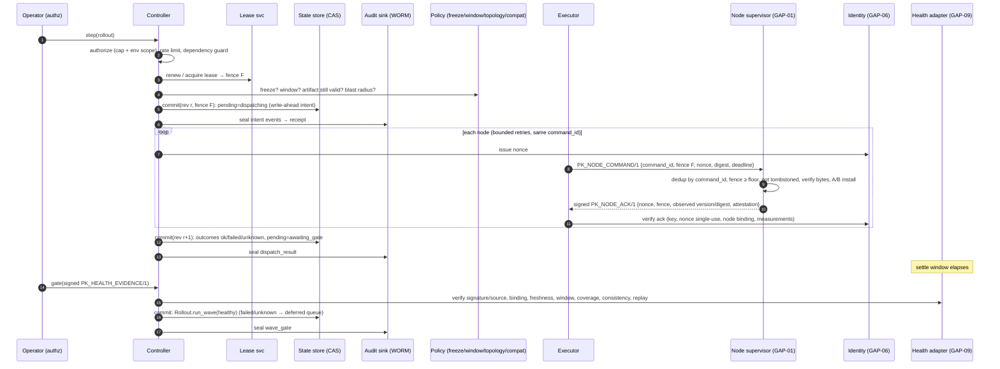

# GAP-08 v4.3.0 — Architecture, component boundaries and data flow

This document satisfies the *boundary*, *data-flow diagram*, *identifier/correlation*, *lifecycle*, *transaction-boundary* and *timeout* items that every section of the GAP-08 professional checklist repeats. Section numbers (§1–§40) refer to that checklist.

## 1. Module map (one component, one module)

| § | Component | Module | Normative objective (short) |
|---|---|---|---|
| 1 | Durable transactional rollout-state store | `store.py` | CAS on revision, fencing, atomic fsync'd writes, digest-verified reads, immutable pin and audit prefix |
| 2 | Controller lease and fencing | `lease.py` | One owner per rollout; monotonic, persisted fencing tokens enforced by store *and* nodes |
| 3 | Cross-rollout conflict detector | `conflicts.py` | Block overlapping env + node/site/lineage scopes before any node command |
| 4 | Authenticated health-gate adapter | `health.py` | Only signed, fresh, bound, covered, non-replayed GAP-09 evidence can pass a gate |
| 5 | Externally sealed audit sink | `audit_sink.py` | Separate-trust-domain, append-only, signed receipts and head; reconstruction |
| 6 | Artifact digest/content verifier | `artifact.py` | GAP-07 statement bound to bundle **and** sha256 content; bytes re-hashed before use |
| 7 | Node-side transactional installer | `installer.py` | A/B slots, boot-tries auto-revert, atomic control block |
| 8 | Rollback executor feedback loop | `executor.py` | Per-node authenticated acks; `ok / failed / unknown`, unknown never success |
| 9 | Blast-radius policy engine | `topology.py` | Per-domain/site unavailability limits, survivors, protected domains, fail closed on unknown/stale |
| 10 | Emergency freeze/disable | `freeze.py` | Global / rollout / artifact freeze; unfreeze needs a second person |
| 11 | Authorization policy layer | `authz.py` | Explicit capabilities, environment scoping, no tenants, two-person approvals |
| 12 | Device identity and attestation | `identity.py` | Enrolled keys, single-use nonces, measurement checks, rotation/revocation |
| 13 | Persistent deferred-node scheduler | `deferred.py` | Queue inside durable state; backoff, budget, expiry, escalation |
| 14 | Idempotent command transport | `transport.py` | Deterministic command ids, node-side dedup, fence floor, rollback tombstones |
| 15 | Fail-closed dependency policy | `dependencies.py` | Per-dependency × op-class policy table; overrides never for store/lease/identity/authz |
| 16 | Retry/backoff/jitter + breaker | `retry.py` | Full jitter, attempt + deadline caps, idempotent-only, per-cohort circuit breaker |
| 17 | Backpressure/admission | `admission.py` | Rollout, fan-out, deferred, API-rate limits; reserved recovery lane |
| 18 | Rollout windows | `windows.py` | Weekly windows (midnight-crossing), blackouts, change freeze; recovery exempt |
| 19 | Bandwidth-aware distribution | `distribution.py` | Chunk manifest, resumable verified fetch, source fallback, site budget |
| 20 | Typed external API schemas | `schemas/*.schema.json`, `schema.py` | 14 versioned JSON Schemas + compatibility rules |
| 21 | Error taxonomy | `errors.py` | `PK_ERROR/1`: stable codes, retry class, remediation, cause chain |
| 22 | Observability exporter | `telemetry.py` | Bounded-cardinality metrics, Prometheus text, redacted JSON logs, alert rules |
| 23 | Operator explain view | `explain.py` | Why each gate passed/failed, evidence, policy decisions, deferred/quarantine reasons |
| 24 | Backup/restore & DR | `store.py` (`backup`/`restore`), `docs/RUNBOOKS.md#disaster-recovery` | Verified point-in-time backup, restore-into-empty only |
| 25 | Compatibility matrix | `schemas/compatibility_matrix.json`, `compat.py` | Fail closed on anything unlisted |
| 26 | Configuration provenance | `config.py` | Signed revisions, distinct author/approver, overlays, atomic activate/rollback |
| 27 | Secrets/key boundary | `secrets_boundary.py`, `common.KeyRing` | References not material; scanning before persist; redaction for humans |
| 28 | Cancellation semantics | `controller.cancel/pause/resume` | Cancel-before-touch, cancel→rollback, abandon (two-person) |
| 29 | Quarantine recovery | `controller.release_quarantine` | Two-person, remediation note, authenticated proof node is on the pinned target |
| 30 | Fleet reconciliation | `controller.reconcile` | Authenticated observed vs recorded; drift classes; never mutates nodes |
| 31–36 | Test/certification harnesses | `tests/`, `harness.py`, `tools/benchmark.py`, `tools/soak.py` | See `CHECKLIST_STATUS.md` |
| 37–38 | Release evidence, SBOM | `tools/release_evidence.py` | Evidence bound to exact file digests; CycloneDX SBOM |
| 39–40 | ADR, owners | `docs/ADR-0001-control-plane.md`, `docs/OWNERS.md` | |

`rollout.py` (the v4.2.0 pure state machine) stays the single place rollout invariants live. `controller.py` composes everything; it never writes node versions except through `Rollout` (plus audited quarantine release, re-validated on commit).

## 2. Data flow — forward wave (happy path)



## 3. Data flow — failed gate / operator rollback (two-phase)

```mermaid
sequenceDiagram
    participant C as Controller
    participant S as State store
    participant X as Executor
    participant N as Nodes
    participant A as Audit sink
    C->>S: commit rollback_intent (CAS) — loser of any race stops here, touches nothing
    C->>X: rollback commands to every node on bundle ∪ pending-applied
    X->>N: fenced, idempotent rollback; node tombstones the rollout (late installs rejected)
    N-->>X: signed acks
    C->>S: commit: Rollout.run_wave/retry_deferred/rollback(fail_nodes = non-ok) → quarantine
    C->>A: seal (buffered if sink down — rollback never waits for the sink)
```

## 4. Restart / takeover

```mermaid
sequenceDiagram
    participant B as New controller
    participant L as Lease svc
    participant S as Store
    participant N as Nodes
    B->>L: acquire → fence F+1 (old holder now fenced at store and nodes)
    B->>S: load + verify digest, invariants, audit chain
    alt rollback_intent present
        B->>N: finish rollback (same command ids → no double execution)
    else pending = dispatching
        B->>N: re-send same install command ids (dedup) → collect acks
    end
    B->>S: commit controller_takeover + outcomes; seal buffered audit events
```

## 5. Identifiers and causal linkage

| Identifier | Scope | Where |
|---|---|---|
| `rollout_id` | rollout | every record, command, ack, evidence, audit event, lease resource `rollout/<id>` |
| `state revision` | store record | CAS precondition (`expected_revision`) |
| `fence` | lease acquisition | store commits, node commands, node acks |
| `cohort` (`wave-N`, `retry-K`) | gate | pending dispatch, health evidence binding, gate verdict |
| `command_id` = H(rollout, op, node, target, attempt group) | node operation | idempotency / dedup key; stable across retries and takeovers |
| `nonce` | one delivery | issued by identity registry, echoed in ack, single use |
| `evidence_id` + `nonce` | health evidence | anti-replay key |
| `verification_ref` | GAP-07 statement | digest of the signed statement, persisted in state + audit |
| `ack_ref` | node ack | digest of the signed ack, persisted in dispatch/rollback outcomes |
| audit `sequence` / `event_hash` / `prev_hash` | local chain | sealed as full events; sink `seq`/`sealed_hash` chain |
| `trace_id` | log line | structured logs (correlates with GAP-09 traces) |

Causal chain for every node mutation: `rollout_created` (authorized principal, verified artifact, compat, inventory version) → `policy_admitted` (topology decision) → `dispatch_intent` (fence) → `dispatch_result` (command id, ack ref, observed state) → `wave_gate`/`deferred_gate` (evidence ref) → sealed receipts.

## 6. Lifecycle / state-transition table

| Phase | Legal operations | Next phase | Terminal |
|---|---|---|---|
| `admitted` | step, retry_deferred, pause/resume, rollback, cancel, reconcile, reverify | `awaiting_gate`, `rolled_back*`, `cancelled`, `abandoned` | no |
| `awaiting_gate` | gate, rollback, pause/resume, cancel(rollback/abandon), reconcile | `admitted`, `deferred`, `complete`, `rolled_back*`, `abandoned` | no |
| `deferred` (all waves done, nodes outstanding) | retry_deferred, reverify, rollback, cancel, reconcile | `awaiting_gate`, `rolled_back*` | no |
| `complete` | reconcile, read | — | yes |
| `rolled_back` | reconcile, read | — | yes |
| `rollback_incomplete` | release_quarantine, reconcile | `rolled_back` (when every failure released) | yes (for forward ops) |
| `cancelled`, `abandoned` | reconcile, read | — | yes |

Cross-cutting flags: `paused` blocks step/retry; `rollback_intent` blocks everything except finishing the rollback (`recover`). Repeated calls: `step` with a pending gate → `ILLEGAL_TRANSITION`; `gate` without pending → `ILLEGAL_TRANSITION`; replayed evidence → `EVIDENCE_REJECTED`; duplicate command delivery → stored result, no re-execution; out-of-order install after rollback → node tombstone rejection.

## 7. Transaction and visibility boundaries

* **Accepted**: the operation passed authorization, policy and dependency guards (no state change yet).
* **Committed / recoverable**: `store.commit` returned — fsync'd, CAS-won, fence-checked. A crash after this point is recovered by `recover()`.
* **Externally visible**: the matching audit event is sealed in the WORM sink (`sealed_count` covers it). Forward operations refuse to start while any event is unsealed.
* **Acknowledged (node)**: an authenticated ack for the command's nonce was verified.
* **Side effects are always preceded by a CAS-won intent** (`pending=dispatching` or `rollback_intent`), so the loser of any race never touches a node.

## 8. Timeouts and deadlines (no unbounded waits)

| Call | Bound | Timeout means |
|---|---|---|
| node command | `deadline = issued_at + 300 s` (node refuses later), retries `BackoffPolicy(max_attempts, deadline_s)` | **unknown outcome** → deferred + reconcile (install) / quarantine (rollback) |
| lease | TTL ≤ 120 s; renew on every operation; lapse → re-acquire (new fence) or `CONFLICT` | holder must stop |
| health evidence | `max_age_s` 300, `settle_s` 60, future skew 5 s | rejected (hold), never pass |
| GAP-07 statement | `expires_at` (24 h in harness) | forward blocked until `reverify` |
| approvals | ≤ 1 h | expired approval refused |
| deferred node | backoff 60 s → 1 h, 10 attempts, 7-day expiry | escalated |
| nonce | 600 s | ack refused |
| attestation | 3600 s | ack refused |
