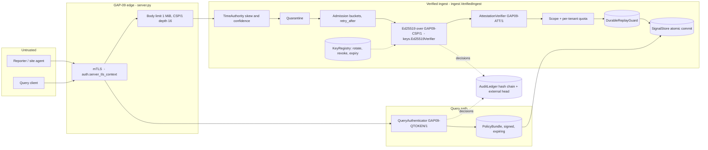

# GAP-09 v5.1.0 — trust boundary (normative)

Applies to components 01–15, 19 and 40. Every arrow that crosses a dashed box is
an untrusted input until the named check has passed. Every decision fails closed.

| Trust root | Held by | Rotation | Status in this archive |
|---|---|---|---|
| Reporter signing keys (Ed25519) | `KeyRegistry` | `rotate()` with overlap window | real mechanism; keys in tests are fixtures |
| Attestation endorsement roots | `AttestationVerifier.roots` | replace root set | **fixture only** — real GAP-06 roots BLOCKED |
| Policy-service signing key | `PolicyBundle` | new key → new bundle | **fixture only** — real policy service BLOCKED |
| Query-gateway token keys | `QueryAuthenticator.issuer_keys` | kid set | **fixture only** — real gateway BLOCKED |
| mTLS CA | `server_tls_context(client_ca=…)` | CA bundle swap | test CA generated per run |

Fail-open decisions: **none**. `allow_legacy_trust=True` is refused by the
production config validator (`config.DANGEROUS`).
