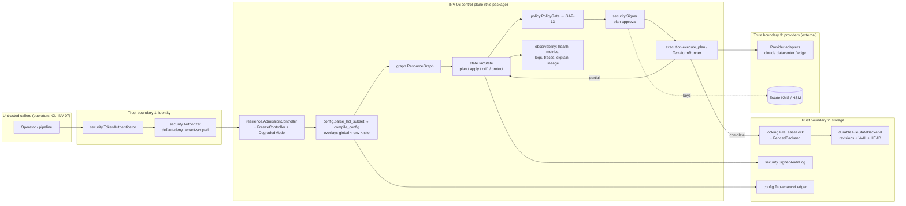

# INV-06 Traditional IaC — Architecture (v4.3.0)

Status: **Draft for review** (MC-003 ADR approval pending). Covers baseline check CHK-007 for every implemented component.

## Component boundaries and data flow

## Control flow of one change

1. Authenticate caller → authorise `plan.create` for tenant.
2. Admission (bounded concurrency/queue); refuse if frozen or critical dependency down.
3. Parse + compile configuration (pinned subset, overlay precedence), build the resource graph (cycles/dangling refused).
4. `IacState.plan(desired)` against the HEAD serial loaded from the backend (digest-verified).
5. `PolicyGate.check(plan)` — fail closed, decision bound to plan digest and policy version.
6. A different principal with `plan.approve` signs the plan (separation of duties).
7. Applier acquires a lease (fencing token) → `execute_plan` drives the provider in graph order.
8. Only a complete provider run is applied to `IacState` and committed through `FencedBackend.commit` (CAS on serial + fencing). A partial run triggers drift reconciliation; nothing is committed.
9. Audit event (signed), provenance record, lineage record, metrics/logs/trace emitted.

## Failure domains

| Domain | Failure | Safe behaviour | Code |
|---|---|---|---|
| Process | crash mid-commit | WAL recovery rolls forward/back deterministically | `durable.recover` |
| Host disk | corrupt revision | refuse load, restore from backup | `durable.StateCorrupt`, `restore` |
| Concurrency | two writers | CAS + fencing; one wins | `StateConflict`, `FencingViolation` |
| Policy engine | down / malformed | fail closed | `PolicyUnavailable` |
| Identity/keys | down | per `OUTAGE_POLICY` | `outage_decision` |
| Provider | partial failure | stop, report, reconcile via drift | `execute_plan` |
| Overload | burst | shed with `Overloaded` | `AdmissionController` |
| Site | loss | residency-and-serial-aware failover | `FailoverController` |

## Not in this package (explicit exclusions)

Real cloud/datacenter provider adapters, Terraform binaries, estate KMS/HSM, distributed consensus lock services, WORM audit storage, CI runners, dashboards hosting. These are integration points, declared by protocol (`execution.Provider`, `security.KeyProvider`, `locking.LeaseBackend`, `policy.PolicyEngine`).
