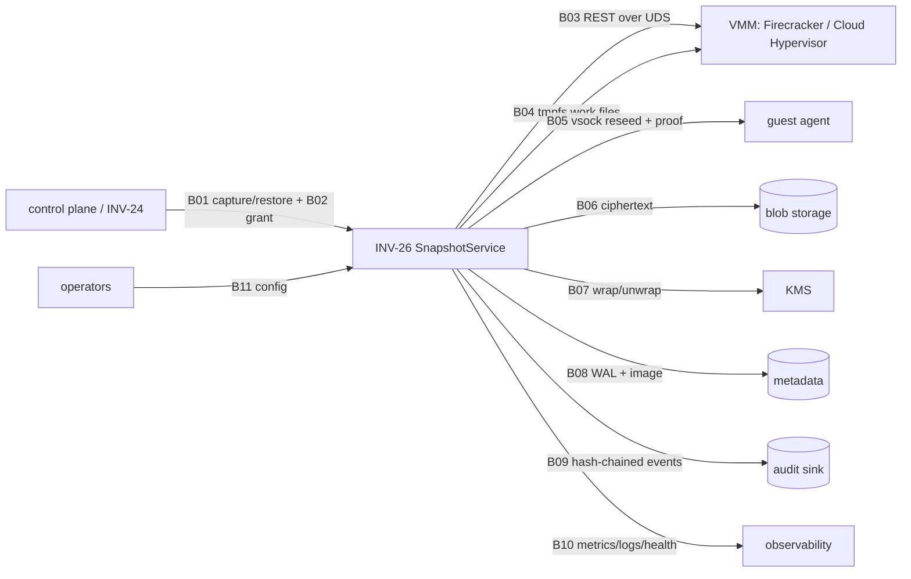

# Interfaces, boundaries and limits (C021, C022, C025, C026, C028, C029)

Machine-readable boundary inventory: `ops/boundaries.json` (B01–B12). Schemas: `schemas/*.schema.json`
(generated from `schema.py`; CI fails on drift). Examples: `examples/`. Conformance fixtures:
`tests/fixtures/conformance/cases.json` (valid and invalid, executed by the test suite).

## Operations
| Op | Capability | Request schema | Response |
|---|---|---|---|
| capture | snapshot.capture | PK_SNAPSHOT_CAPTURE_REQUEST/2 | PK_SNAPSHOT/2 |
| restore | snapshot.restore + one-shot grant | PK_SNAPSHOT_RESTORE_REQUEST/2 | PK_SNAPSHOT_RESTORE/2 |
| inspect | snapshot.inspect | {snapshot_id} | PK_SNAPSHOT_INSPECT/1 (no key material) |
| delete | snapshot.delete | {snapshot_id} | crypto-erased tombstone |
| quarantine / release | snapshot.quarantine | {snapshot_id, reason} | state |
| disable / enable | snapshot.admin | {reason} | emergency switch |

Errors: always `PK_SNAPSHOT_ERROR/1` (code, number, outcome, retryable, public message, correlation id,
optional retry_after_s). Catalog: `ERRORS.json`.

## Timeouts, cancellation, retry, idempotency, backpressure (C025)
* End-to-end deadline: `min(timeouts_ms.<op>, request.deadline_ms)`; checked before every dependency call;
  cancellation (`Deadline.cancel`) is observed before the next side effect; a cancelled/expired restore
  destroys any loaded guest.
* Idempotency: capture — `idempotency_key` (scoped per tenant, request digest bound); restore — the grant nonce
  plus the idempotency key. Both persist in the durable metastore and survive restart.
* Retry: only catalog-retryable errors; full-jitter exponential backoff (`retry.base_ms`..`cap_ms`),
  `retry.attempts`, shared retry budget (`retry.budget_ratio`); never for policy/integrity errors.
* Backpressure: admission rejects with `SNAP_OVERLOADED` + `retry_after_s` before any storage/KMS/VMM work;
  metrics `inv26_admission_rejected_total{reason}`, `inv26_inflight`.

## Limits (C028) — enforced at the parser/admission layer
| Limit | Value | Where |
|---|---|---|
| request document | 64 KiB | `schema.MAX_DOC_BYTES` |
| nesting depth | 8 | `schema.MAX_DEPTH` |
| identifiers | `[a-z0-9][a-z0-9._-]{0,62}` | schemas |
| devices per snapshot | 1..64 (config `quotas.max_devices` ≤ 64) | schema + service |
| memory_mib | 1..1 048 576 (config `quotas.max_memory_mib`) | schema + service |
| credential / grant | 4096 bytes | `auth.MAX_TOKEN_BYTES` |
| capability entries | 64 | `auth.authenticate` |
| concurrent ops / queue / per tenant | `admission.*` | `resilience.Admission` |
| per-tenant state entries | 10 000 tenants | `Admission.slot` |
| decision records kept | 2 000 (LRU) | `service.MAX_DECISIONS` |
| metric series per metric | 200 (overflow bucket) | `telemetry.MAX_SERIES_PER_METRIC` |
| envelope chunk | 4 KiB .. 64 MiB; chunks ≤ 2^24 | manifest schema |
