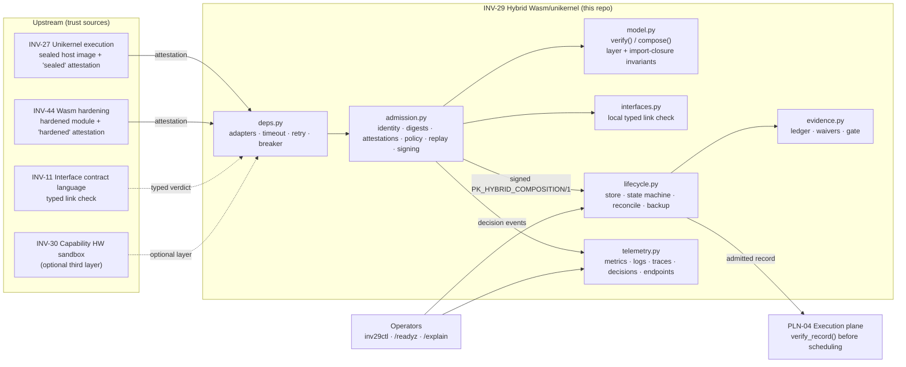

# INV-29 Architecture and data flow (INV29-MC012)

**Version:** 4.3.0 · **Owner:** see `OWNERS.md` · **Review:** every material architecture/interface/security change, and quarterly (`governance/REVIEW.md`)

## Position in the estate

INV-29 is a *decision element*: it neither builds images, compiles modules, runs a Wasm runtime nor schedules work. It receives two already-built artifacts plus their attestations, decides whether the pair may run as a two-layer hybrid, and emits a signed composition record that the execution plane (PLN-04) must verify before scheduling.

## Trust boundaries

| # | Boundary | What crosses | Enforced by |
|---|---|---|---|
| TB1 | INV-27 / INV-44 → INV-29 | attestations over artifact digests | `admission._verify_attestation` (key, subject digest, claim, freshness, MAC) |
| TB2 | caller → INV-29 | `AdmissionRequest` (untrusted) | type/shape checks in `model.py`, tenant/digest regex, policy |
| TB3 | serialized records ↔ disk/network | JSON records | `records.parse` (bounded, strict) + JSON Schemas |
| TB4 | INV-29 → PLN-04 | signed composition record | `verify_record` (schema, signature, expiry) at the consumer |
| TB5 | operators → INV-29 | control file, policy generations | `ControlFile` (fail closed), monotonic `set_policy`, audited `rollback_policy` |
| TB6 | Wasm guest ↔ unikernel host | imports | import closure (name) + typed link (INV-11 / `interfaces.py`) |

## Decision pipeline (order is significant)

1. Emergency-disable check (`INV29-E-DISABLED`).
2. Tenant id format + allow-list (`IDENTITY` / `POLICY`).
3. Digest format for module and host (`IDENTITY`).
4. `compose()` — both layers independently verified, import closure (`LAYER` / `IMPORT`).
5. Policy layer bar (`required_layers`), denylist on imports **and** host exposure, cardinality, provenance (`POLICY`).
6. Attestations for `sealed` (host digest) and `hardened` (module digest), optional `measured-boot` (`ATTESTATION`).
7. Typed interface link when metadata is supplied or required (`INTERFACE`).
8. Nonce consumption — last, so refused requests do not burn nonces (`REPLAY`).
9. Sign, schema-validate, return.

## Deployment topology assumptions

* One `Admitter` per process; state that must be shared across replicas (replay cache, store) is **not** shared by this reference implementation. Multi-replica deployments must front the replay guard with a shared store or pin tenants to replicas — recorded as BLOCKED_EXTERNAL (MC037 fleet scale).
* Nodes: x86_64 or aarch64 hosts; Wasm targets wasm32/wasm64 (see `docs/COMPATIBILITY.md`).
* The hypervisor is out of scope and never supplies imports (contract non-goal).
