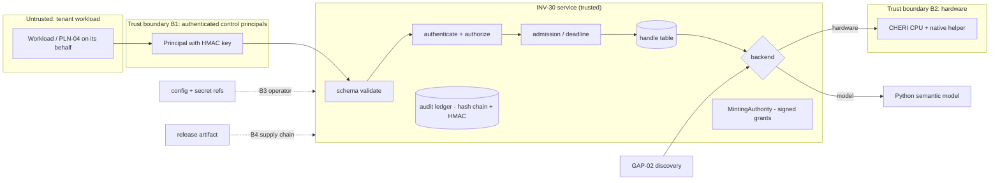

# INV-30 threat model (INV30-GAP-027 · INV-30-C041, C050, C087)

## Data flow and trust boundaries

## Threats (STRIDE + capability-specific) → controls → tests
| ID | Threat | Actor | Control | Test |
|---|---|---|---|---|
| T-01 | Pointer/handle forgery, OOB access | malicious tenant | 128-bit random handles; bounds check | test_security T-01, P1 |
| T-02 | Permission/bounds amplification on derive | compromised workload | attenuation-only derive | T-02, P2/P3, chains |
| T-03 | Use-after-invalidate / resurrection | compromised workload | absorbing invalidation, locks | T-03, P4, concurrency |
| T-04 | False hardware claim / silent downgrade | misconfig, operator | `enforcement` stamp, HARDWARE_REQUIRED, forbidden knob | T-04, failover test |
| T-05 | Cross-tenant use | malicious tenant | tenant-bound handles + grants | T-05 |
| T-06 | Spoofing a principal, action confusion | network attacker | HMAC over action+body+ts+nonce | T-06 |
| T-07 | Replay | network attacker | nonce cache, skew | T-07 |
| T-08 | Privilege escalation | lower-privilege principal | action-scoped authz | T-08 |
| T-09 | Injection / hostile input | any | schema-first validation, bool≠int | T-09, P5, P6 |
| T-10 | Forged provenance of a root | insider with memory access | signed grants verified on every use | T-10 |
| T-11 | Resource exhaustion | malicious tenant | limits, quotas, depth, admission | T-11 |
| T-12 | Info disclosure via diagnostics | any | redaction, tenant buckets, repr hides base | T-12 |
| T-13 | Audit tampering / truncation | insider | hash chain + HMAC + anchored head | T-13 |
| T-14 | Rogue node/peer | network attacker | attestation verification | T-14 |
| T-15 | Weak keys | operator | ≥256-bit enforced | T-15 |
| T-16 | Timing side channel on MAC | network attacker | `hmac.compare_digest` | T-16 (static) |
| T-17 | Supply-chain tampering | upstream | manifest + SBOM + signature, offline verify | test_config_integrity |
| T-18 | Control-plane abuse (config) | operator | validation, provenance, review | test_config_integrity |
| T-19 | Duplicate/stale controller | ops error | fencing lease epoch | test_resilience |
| T-20 | Micro-architectural side channels (Spectre-class) on CHERI | tenant | **out of scope of the model**; requires hardware mitigations — residual risk | none (hardware) |

## Residual risks
* The Python model is not unforgeable: code with interpreter access can mutate objects. Mitigation: callers only
  hold handles; the model is labelled; hardware tier needed for real enforcement.
* T-20 and physical attacks are unaddressed until a hardware backend exists.
* HMAC shared keys (not PKI) — acceptable inside one estate; public deployments need asymmetric signing.
