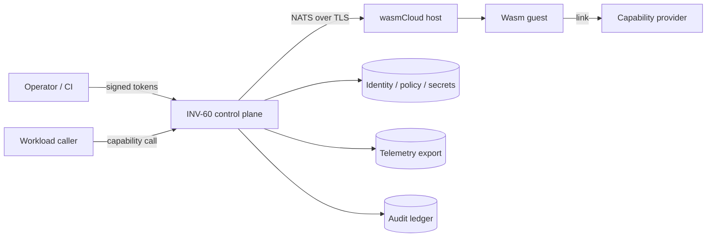

# Threat model (M34) — generated from THREAT_MODEL.json

Method: STRIDE per data flow; likelihood/impact L/M/H; release-blocking = impact H with no verified control

**Assets:** artifacts/code, identities/keys, tenant data, policy, configuration, control state, audit records, availability, provenance

**Trust boundaries:** client/operator -> control plane; control plane -> NATS; NATS -> wasmCloud host; host -> wasm guest; guest -> capability provider; control plane -> identity/policy/secret services; control plane -> telemetry export

**Attackers:** unauthenticated remote, authenticated tenant, compromised workload/provider, compromised host, malicious insider/operator, compromised CI/signing, network attacker

## Data flow

## Threats
| id | flow | STRIDE | threat | L/I | controls | verified by |
|---|---|---|---|---|---|---|
| T01 | deployer -> fabric (push/start) | Tampering | tag substitution runs an unsigned artifact | M/H | digest-addressed refs only (schema rejects tags); signature+provenance admission; start requires admitted ref | `test_security.Adversarial.test_T01_tag_substitution_refused_by_schema` `test_security.ArtifactSigning.test_start_bypass_impossible` |
| T02 | registry storage | Tampering | bytes swapped after verification (TOCTOU) | L/H | runtime re-hashes at instantiate; verified bytes object is what is stored | `test_security.ArtifactSigning.test_registry_swap_after_verification_detected` |
| T03 | signer -> fabric | Spoofing | artifact signed by revoked or out-of-scope signer | M/H | signer revocation list; per-signer subject globs; min SLSA level + builder allow-list; trust-root age limit | `test_security.ArtifactSigning.test_revoked_signer` `test_security.ArtifactSigning.test_wrong_subject_scope` `test_security.ArtifactSigning.test_stale_trust_root` |
| T04 | workload -> provider (call) | Elevation of privilege | cross-tenant invocation / forged link | M/H | capability grants bound to grantee, tenant, ops, expiry; default deny | `test_security.Authorization.test_cross_tenant_invocation` `test_security.Authorization.test_operation_not_in_grant` |
| T05 | any principal -> fabric | Spoofing | replayed or spoofed credential | M/H | Ed25519 holder-signed tokens; nonce replay cache; session binding; audience/issuer checks | `test_security.Authentication.test_replay` `test_security.Authentication.test_spoofed_signature` `test_security.Authentication.test_session_binding` |
| T06 | host enrolment | Spoofing | cloned or unattested host joins lattice | L/H | one-time enrolment codes; attestation bound to key; clone key/endpoint detection | `test_security.Authentication.test_host_requires_attestation` `test_security.Authentication.test_cloned_key_rejected` `test_security.Authentication.test_clone_from_unexpected_endpoint` |
| T07 | operator/client -> fabric | Tampering | injection via identifiers | M/M | identifier validation; schema patterns | `test_security.Adversarial.test_T07_injection_in_names` `test_fuzz.Fuzz.test_wire_decode` |
| T08 | controller <-> controller | Tampering | split-brain: two controllers grant conflicting authority | M/H | quorum lease; fencing epochs; isolated mode refuses new authority | `test_resilience.Membership.test_minority_partition_cannot_grant_authority` `test_resilience.Membership.test_failover_without_quorum_refused` |
| T09 | client -> fabric | Denial of service | oversized payloads, request floods | H/M | size limits before parse; token buckets; in-flight caps; circuit breakers | `test_security.Adversarial.test_T09_oversized_payload` `test_semantics.ResourceLimits.test_token_bucket_burst_and_refill` |
| T10 | host -> fabric (membership) | Elevation of privilege | host enrols or impersonates another host | L/H | hosts may only enrol themselves | `test_security.Adversarial.test_T10_host_cannot_enrol_other_host` |
| T11 | fabric -> telemetry | Information disclosure | telemetry exfiltration of identities/secrets | M/M | label allow-list; redaction; bounded diagnostics | `test_security.Adversarial.test_T11_telemetry_exfiltration_blocked` |
| T12 | fabric -> caller (errors) | Information disclosure | secret leakage via error messages | M/M | redaction; size bounds | `test_security.Adversarial.test_T12_error_does_not_leak_secret` `test_semantics.ResultModel.test_size_bound_and_redaction` |
| T13 | fabric audit | Repudiation | audit log modified/truncated | L/H | hash chain + HMAC; external head anchor | `test_resilience.Ledger.test_detects_modification_deletion_reorder_truncation` |
| T14 | wasm guest -> host | Elevation of privilege | sandbox escape via ambient imports / runaway execution | M/H | import-free instantiation; memory ceiling; wall-clock kill | `test_config_observability.WasmExecution.test_sandbox_refusals` `test_config_observability.WasmExecution.test_timeout_kills_runaway` |
| T15 | identity/policy services | Denial of service | fail-open during identity/policy outage | M/H | fail closed with UNAVAILABLE | `test_security.Authentication.test_dependency_unavailable_fails_closed` `test_security.Authorization.test_policy_engine_unavailable_fails_closed` |
| T16 | NATS transport | Information disclosure | plaintext lattice traffic | M/H | config requires tls:// and require_tls (overlays cannot weaken) | `test_config_observability.Overlays.test_lower_trust_cannot_weaken` |

## Residual risks (proposed, unapproved)
- **RR1** pure-Python Ed25519 is not constant time (timing side channel) — owner UNASSIGNED, review by 2026-12-31
- **RR2** no transport encryption in the reference tier (T16 relies on the real NATS/TLS layer) — owner UNASSIGNED, review by 2026-12-31
- **RR3** no hardware attestation; reference quote only — owner UNASSIGNED, review by 2026-12-31

Review cadence 90 days; triggers: architecture change, interface change, trust boundary change. Last review: none.
