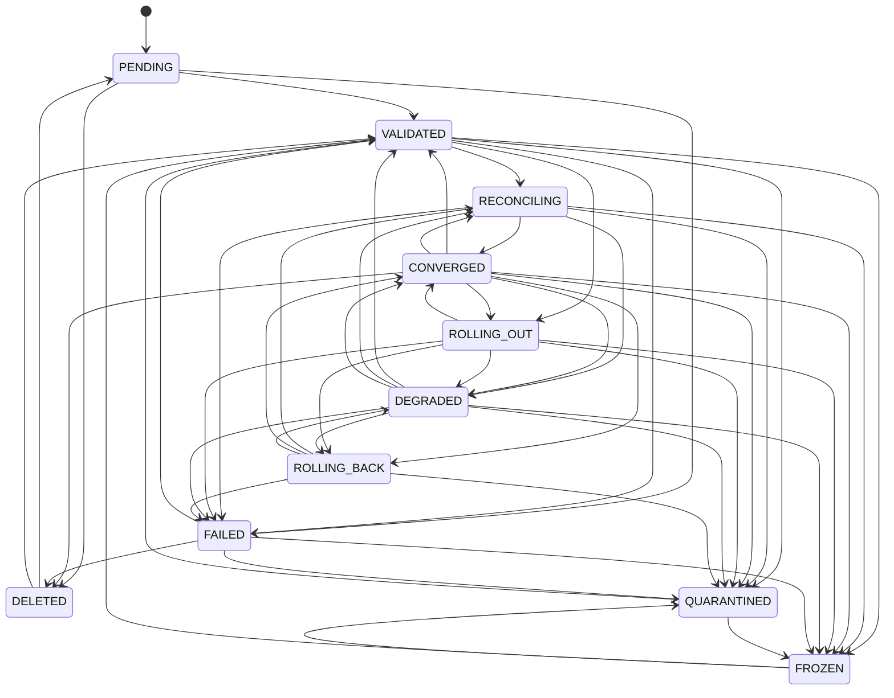

# INV-63 Deployment Lifecycle

| Field | Value |
|---|---|
| Document ID | INV63-ARCH-LIFECYCLE |
| INV-63 C-IDs covered | C015 |
| Status | DRAFT — pending approval |
| Owner | Service owner (role) — UNASSIGNED |
| Reviewers | Architecture reviewer (role), SRE lead (role) — UNASSIGNED |
| Revision | 4.3.0 |
| Approval date | pending |
| Supersedes | none |
| Change-review triggers | Revisit when interfaces, state ownership, topology or dependencies change, or when `lifecycle.TRANSITIONS` changes. |

Source: `lifecycle.py` (`State`, `TRANSITIONS`, `check_transition`, `Lifecycle`). Tracked per `(tenant, component)`. Every service transition goes through `service.py::DeploymentService._move`, which calls `Lifecycle.move` (illegal → `INV63-E-ILLEGAL-TRANSITION`) and journals a `lifecycle` record. A new workload must start in `PENDING`. Self-transitions are no-ops. Replay uses `Lifecycle.restore` (trusts journaled, already-checked states).

## States

| State | Meaning |
|---|---|
| PENDING | desired state accepted, not yet validated |
| VALIDATED | admission + policy passed |
| RECONCILING | diff being applied |
| CONVERGED | actual == desired; reconcile is a no-op |
| ROLLING_OUT | bounded version change in progress |
| DEGRADED | running below desired (capacity/offline); retried |
| ROLLING_BACK | automatic or operator rollback in progress |
| FAILED | terminal; operator action required |
| QUARANTINED | unsafe behaviour isolated; no automated actions |
| FROZEN | operator freeze; no automated actions |
| DELETED | desired count 0 and all instances stopped |

## Legal transitions (`TRANSITIONS`)

| From | To |
|---|---|
| PENDING | VALIDATED, FAILED, DELETED |
| VALIDATED | RECONCILING, ROLLING_OUT, FAILED, QUARANTINED, FROZEN |
| RECONCILING | CONVERGED, DEGRADED, FAILED, QUARANTINED, FROZEN |
| CONVERGED | VALIDATED, RECONCILING, ROLLING_OUT, DEGRADED, ROLLING_BACK, QUARANTINED, FROZEN, DELETED |
| ROLLING_OUT | CONVERGED, DEGRADED, ROLLING_BACK, FAILED, QUARANTINED, FROZEN |
| DEGRADED | VALIDATED, RECONCILING, CONVERGED, ROLLING_BACK, FAILED, QUARANTINED, FROZEN |
| ROLLING_BACK | RECONCILING, CONVERGED, DEGRADED, FAILED, QUARANTINED |
| FAILED | VALIDATED, QUARANTINED, FROZEN, DELETED |
| QUARANTINED | VALIDATED, FROZEN |
| FROZEN | VALIDATED, QUARANTINED |
| DELETED | PENDING, VALIDATED |

## Which code path drives each transition

| Transition | Driver (`service.py`) |
|---|---|
| (none)/DELETED → PENDING | `op_set_desired` when lifecycle is `None` or `DELETED` |
| * → VALIDATED | `op_set_desired` after schema/signature/quota/residency checks; `_control(..., "remove")` (unfreeze / release_quarantine). `DELETED → VALIDATED` is legal but `op_set_desired` goes via PENDING |
| VALIDATED/DEGRADED/CONVERGED/ROLLING_BACK → RECONCILING | `reconcile_ns` (no-op path from VALIDATED/DEGRADED; non-empty diff path from any state; after `op_rollback`) |
| RECONCILING → CONVERGED | `reconcile_ns` (no actions, or all actions committed) |
| CONVERGED → DELETED | `reconcile_ns` when desired `count == 0` and nothing remains |
| RECONCILING → DEGRADED | `reconcile_ns` when any start fails (`PARTIAL`); `_to_degraded` when offline (from VALIDATED it passes via RECONCILING) |
| VALIDATED/CONVERGED → ROLLING_OUT | `op_rollout` |
| ROLLING_OUT → CONVERGED | `op_rollout` success |
| ROLLING_OUT → ROLLING_BACK | `op_rollout` on any `DeploymentError` in a batch |
| ROLLING_BACK → CONVERGED / DEGRADED | `op_rollout` after a successful `_rollback`, by running count vs desired |
| ROLLING_BACK → FAILED | `op_rollout` when `_rollback` itself raises: `INV63-E-ROLLOUT-FAILED` with `details.state = "FAILED"`, metric `rollbacks{kind="failed"}` |
| CONVERGED/DEGRADED → ROLLING_BACK | `op_rollback` (operator), then `reconcile_ns` |
| * → FROZEN / QUARANTINED | `op_freeze` / `op_quarantine` via `_control` (only for a specific component that already has a lifecycle; `tenant/*` targets change controls only) |

Not reached by any current code path: `PENDING → FAILED/DELETED`, `VALIDATED/RECONCILING/ROLLING_OUT/DEGRADED → FAILED`, `FAILED → DELETED`. `FAILED` is left only by operator action (`freeze`/`quarantine` then release → `VALIDATED`, or `set_desired` → `VALIDATED`). Illegal-transition rejection is tested by `tests/test_service.py::SemanticsTest::test_illegal_transitions_rejected`. `op_rollout` has no explicit state precondition; it is guarded by `TRANSITIONS` — a rollout while `DEGRADED` raises `INV63-E-ILLEGAL-TRANSITION` (by design: DEGRADED→ROLLING_OUT is not legal).
