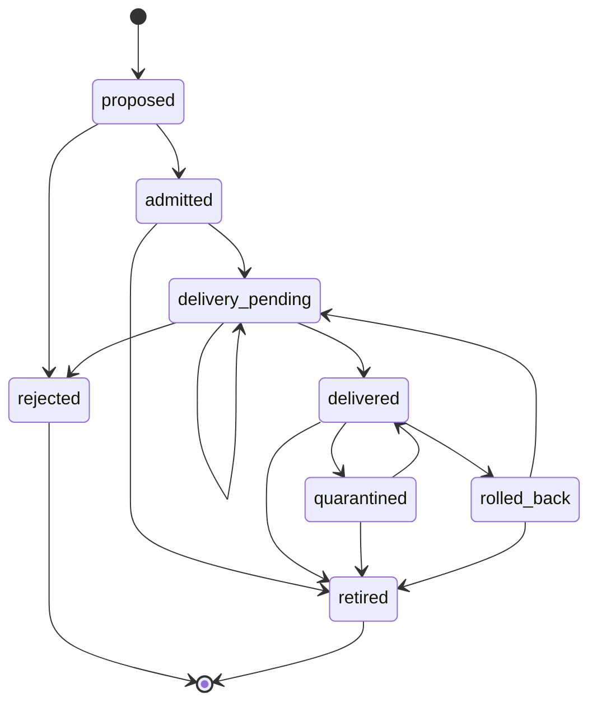

# Lifecycle / state-transition model (MC-008)

Generated from `production/lifecycle.py` by `tools/gen_docs.py` — do not edit by hand.

| Transition | Initiator | Guard | Durable write | Retry semantics |
|---|---|---|---|---|
| proposed → admitted / rejected | admission pipeline | all guardrails, provenance and policy checks evaluated against one config snapshot | `admit.decision` | Retrying with the same idempotency key returns the same decision (no re-evaluation). A different body under the same key → `ECP_IDEMPOTENCY_CONFLICT`. |
| admitted → delivery_pending | pipeline | decision journaled | `lifecycle.transition` carrying the work item | — |
| delivery_pending → delivered | delivery worker | INV-63 2xx/409 | `lifecycle.transition` + revision | Retryable failures stay `delivery_pending`. `redeliver_pending()` resumes with the **same decision id**, so the artifact is never re-authorized under the same request. |
| delivery_pending → rejected | delivery worker | INV-63 4xx (permanent) | transition + code | terminal |
| delivered → rolled_back | operator with `quarantine` | decision exists | transition + actor + reason | Rolling back does **not** re-admit anything. Re-delivering needs a new admission, or `rolled_back → delivery_pending` of the same, already-admitted decision. |
| delivered → quarantined → delivered/retired | operator | scope freeze and release rules (2 votes) | transition | — |
| any → retired | operator | — | transition | terminal |

Admission state and deployment state are kept apart: `admitted`/`delivered` means INV-63
**accepted the manifest for reconciliation**. Runtime health belongs to INV-63 and wasmCloud, and
the inventory records it as the delivery revision only.

**GitOps supersession:** a new commit produces a new request with a new idempotency key. The older
decision stays in history. Rolling back to an older revision means re-admitting that revision, so
current policy decides it.

Evidence: `SmallPartsTest.test_lifecycle` (illegal transitions fail closed; terminal states have no
exits), `test_idempotent_duplicates_under_race_yield_one_decision`, and the delivery fault tests.
