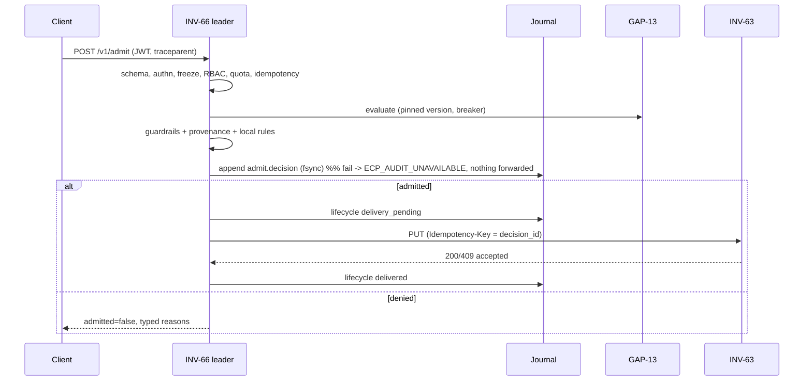

# INV-66 deployment topology (MC-004)

Status: engineering proposal, **not approved** (ADR-0001 is PROPOSED). Sizes come from `docs/CAPACITY.md`.

## Production topology

```mermaid
flowchart LR
  subgraph Z1[Trust zone T1 - tenant/admin ingress]
    C[Tenants, GitOps, operators] -->|HTTPS 443, OIDC JWT or mTLS SPIFFE| GW[L4/L7 gateway TLS passthrough]
  end
  subgraph Z2[Trust zone T2 - control plane, site A]
    GW --> L[INV-66 leader :8443]
    GW --> F[INV-66 follower :8443 read paths]
    L -->|flock + fsync| J[(Shared journal volume: segments, anchors, holds)]
    F -->|read| J
    L -.lease.json epoch.-> J
  end
  subgraph Z3[Trust zone T3 - dependencies]
    L -->|HTTPS OPA data API| P[GAP-13 policy engine]
    L -->|HTTPS PK_ECP_DELIVER/1| D[INV-63 deployment manager]
    L -->|JWKS static / OIDC discovery - adapter| I[Identity provider]
    L -->|OCI registry client - adapter| R[Registries]
    A[Anchor signer, KMS/HSM - adapter] -->|signed anchors| J
    X[SIEM exporter] -->|batches + checkpoint| S[SIEM / security lake]
  end
  D --> W[wasmCloud lattices]
```

## Trust zones and ports

| Zone | Contents | Inbound | Outbound |
|---|---|---|---|
| T1 ingress | clients, GitOps, operators | — | 443/TCP to gateway only |
| T2 control plane | INV-66 replicas, journal volume | 8443/TCP from gateway (TLS 1.2+, mTLS for workloads) | T3 dependencies over HTTPS; the journal volume (NFSv4.1 with locking, or a replicated block device) |
| T3 dependencies | GAP-13, INV-63, IdP, registries, KMS, SIEM | from T2 only | — |

East-west calls from T2 to T3 use HTTPS and verify the service identity. Administrative traffic
(RBAC, config, quarantine) goes through the same authenticated API. There is no separate
unauthenticated admin port. `/healthz` is the only unauthenticated route, and it returns only
liveness and version.

## Deployment modes

| Mode | Support | Notes |
|---|---|---|
| Single site, 1 replica | Supported (dev/test) | No HA, and the journal lives on local disk. |
| Single site, N replicas + shared journal | Supported design; **tested with processes on one host** | One leader holds the lease and the others follow. Failover time is about the lease TTL. |
| Multi-site active/passive | Design only | Needs journal replication by the storage layer (block replication or a WORM object store). OPEN_EXTERNAL. |
| Multi-site active/active | **Unsupported** | Would need consensus across sites. Waiver W-04. |
| Disconnected edge | **Unsupported for admission** | A site cut off from the leader can't admit. Workloads that are already delivered keep running (INV-63 owns runtime). |
| DR restore | Supported | `cli backup` / `cli restore` into an empty root (RB-BACKUP). |

## Failure domains and placement

- Replicas in different failure domains (node/rack/zone), and the journal volume replicated across zones by the storage layer.
- The anchor signing key lives in a **different** trust domain (KMS/HSM) from the journal writer.
- N+1 capacity: see `docs/CAPACITY.md`. The leader does all the writes, so N+1 is about availability, not throughput.

## Persisted datasets

| Dataset | Authority | Consistency | Retention class | Residency | RPO / RTO target (PROPOSED) |
|---|---|---|---|---|---|
| Journal segments (`journal/segments`) | **Source of truth** | Linearizable single writer (lease + flock) | `retention_days`, holds, archive before delete | Same region as the site config (`site`) | RPO 0 for acknowledged writes (fsync); RTO ≤ 15 min restore |
| Anchors (`journal/anchors`) | Evidence, derived from the journal | Append | Same as journal, plus a copy exported to SIEM | same | Copy stored outside the journal volume |
| Summaries (`summaries.jsonl`) | Evidence for compacted segments | Append | forever | same | Kept with backups |
| Legal holds (`holds.json`) | Authoritative for retention | Atomic replace | until released | same | Kept with backups |
| Lease (`lease.json`) | Coordination only | flock CAS | ephemeral | — | Not backed up |
| SIEM checkpoint | Exporter progress | Atomic replace | ephemeral | — | Rebuilt from 0 if lost (receiver deduplicates) |
| All projections (config, RBAC overlay, inventory, lifecycle, freezes, idempotency) | **Derived**; rebuilt by replay | — | — | — | Rebuilt on start |

## Scaling units

- Admission CPU scales with the component count per manifest (Ed25519 verify per component). Journal throughput is bounded by fsync latency on the leader.
- Followers scale reads (inventory, audit query, explain) horizontally.
- The inventory is one projection per replica. Sharding by tenant is future work (debt D-03).

## Sequences



Other flows, each covered by tests:

- Denial: the journal records the decision and nothing is sent to INV-63 (`T01`).
- Dependency failure: policy down means deny, or a fresh cache entry is used (`test_policy_engine_down…`). Deployment down leaves the decision `delivery_pending` and it is redelivered later.
- Config activation: stage, then N approvals, then CAS activate (`ConfigTest`).
- Rollback: `rollback_config`, or `rollback_app` for a lifecycle `rolled_back`.
- Emergency freeze: `freeze` / `emergency_disable`. Release needs 2 votes (`T13`, `T14`).
