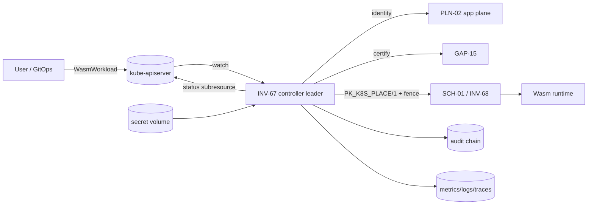

# ADR-001 — Kubernetes integration pattern for INV-67

* **Status:** Proposed (implemented in v4.3.0; **approval by platform, security, SRE and downstream owners is pending** — EXC-002)
* **Date:** 2026-09-22
* **Checklist:** 02 (C010, C031)

## Context

INV-67 must let existing Kubernetes estates drive Host-Wasm workloads without pretending to be a kubelet or an API server. v4.2 was a pure Pod-subset translator with no Kubernetes-native surface.

## Decision

A **namespaced controller/operator** reconciling a dedicated CRD `WasmWorkload` (`inv67.linearfinance.org/v1alpha1`) whose `spec.template` is a Pod-shaped template.

* **CRD rather than native Pods.** Claiming native Pods would contend with the kubelet and the default scheduler for the same objects (two controllers writing one status). A dedicated CRD gives INV-67 exclusive status ownership. Users keep Pod-shaped YAML inside `spec.template`.
* **Controller rather than webhook/sidecar/gateway.** A mutating webhook cannot own lifecycle or deletion; a sidecar needs a Pod we explicitly don't run; a gateway duplicates the API server. A level-triggered controller is the only pattern that owns create → status → delete.
* **Topology.** Cluster-wide watch (optionally narrowed by `watchNamespaces`), 2+ replicas, **one active leader** via Lease with fencing tokens; standbys are idle. Sharding is deferred until the capacity model says one leader saturates (see `CAPACITY.md`).
* **Tenancy.** Namespace → tenant binding is explicit configuration; unbound namespaces are refused.

## Host-Wasm lifecycle mapping

`WasmWorkload` created → finalizer added → identity (PLN-02) → authz → translate (v4.2 boundary) → GAP-15 certification → artifact verification → freeze/quarantine check → admission (quota) → `PK_K8S_PLACE/1` to SCH-01/INV-68 (idempotency key = attempt id, fencing token) → runtime state observed → status/conditions projected → delete → runtime cancel → finalizer removed.

## State ownership

| Field | Sole writer |
|---|---|
| `spec`, `metadata.labels/annotations` | user |
| `metadata.finalizers` (our finalizer) | controller |
| `status.*` | controller (status subresource) |
| runtime placement/unit state | SCH-01/INV-68 |

## Deletion semantics

Finalizer `inv67.linearfinance.org/runtime-cleanup` blocks deletion until downstream cancel succeeds (journalled + fenced). Force-delete (finalizer removal by a human) leaves a possible orphan; orphan detection compares runtime placements with live objects (runbook `orphan-cleanup.md`).

## Upgrade strategy

CRD `v1alpha1` is the only served+storage version. Adding `v1beta1` requires a conversion webhook or a no-op schema-compatible conversion, storage-version migration, and a mixed-version window of one minor release (see `COMPATIBILITY.md`). Controller upgrades are rolling with `maxUnavailable: 0`; leader handoff is safe because the new leader's fencing token is strictly higher.

## Rejected alternatives

Native Pod interception (status ownership races), virtual-kubelet (heavyweight, owns node semantics we don't), admission webhook only (no lifecycle), external gateway (duplicates API server authn/z).

## Trust boundaries

See `THREAT_MODEL.md`. No trust is inherited from namespace or network location: the controller authenticates to the API server with its projected ServiceAccount token and to SCH-01 with mTLS/secretRef credentials.

