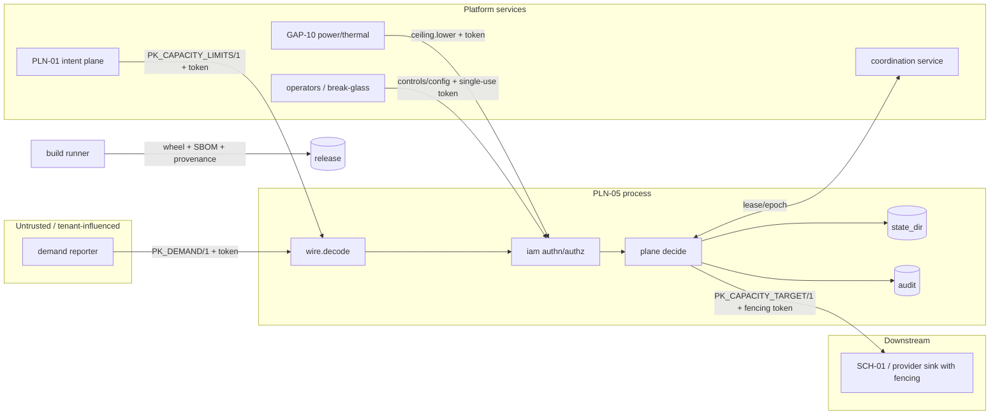

# PLN-05 threat model (PLN05_THREATS/1)

Method: STRIDE per trust boundary, plus attacker classes; machine-readable list with severity, mitigation and the test that verifies it in `security/threats.json` (T01–T20). Review trigger: any change to `spec/pln05_scope.json`, `security/capabilities.json`, a schema, or a new adapter; otherwise quarterly (`governance/reviews.json`).

## Assets

authority envelope (floor/ceiling/thresholds), active configuration, controller state, demand samples, identity tokens and keys, emitted targets, release artifacts, evidence bundle, audit log.

## Trust boundaries and data flows

## Attacker classes

malicious tenant; compromised workload/reporter; compromised operator credential; malicious dependency; compromised build runner; network attacker; compromised provider/consumer; insider; stale controller instance.

## Analysis summary (details and tests in threats.json)

| Area | Threat ids | Key mitigation |
|---|---|---|
| spoofing of demand / limit authorities | T01, T02, T10, T11 | HMAC tokens, source/issuer binding, key windows & revocation, TransportPolicy |
| tampering: artifacts, config, state, evidence, downloads | T12, T13 | digest + approved-version check, HMAC envelopes, audit chain + signed anchor, zero runtime deps |
| replay / rollback to stale package or config | T04, T12 | message_id/seq, single-use nonces, revision monotonicity, approved-versions list |
| privilege escalation via admin/freeze/ceiling | T02, T03, T09, T17 | default deny, separate capabilities, two-person resume |
| DoS: parsing, queues, retries, telemetry, coordination | T07, T14, T15 | byte/depth/field caps, admission + reserve, retry budget, breakers, series cap |
| multi-tenant leakage via metrics/logs/timing | T06, T16 | scope checks before lookup, no tenant labels, constant-time MAC compare |
| supply chain: typosquatting, substitution | T13 | stdlib-only runtime; pk_core optional and unresolved → gate fails rather than resolving arbitrary packages |
| stale controller / split brain | T18 | lease epochs, fencing tokens, persisted epoch |
| security-service outage | T19 | fail-closed/fail-static table, degraded forbids scale-up |
| scale-to-zero suppression | T20 | floor is intent-plane authority, freeze, audit |

## Security invariants

1. No input on the data path can raise the envelope. 2. Loss of any security dependency never grants authority. 3. Every authority change is attributable in a tamper-evident log. 4. A controller without a live lease cannot take effect downstream.

## Residual / not covered here

Side-channel timing beyond MAC comparison is not analysed; network transport is enforced by adapters not shipped in this package; the release signing key is ephemeral (managed signing is a release blocker).
