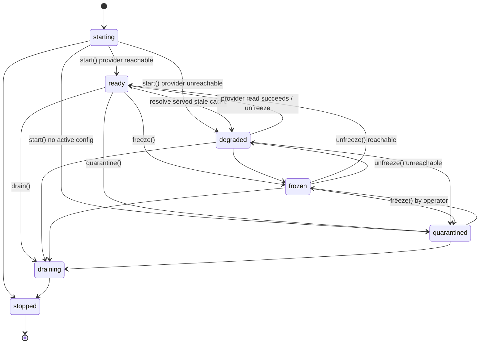
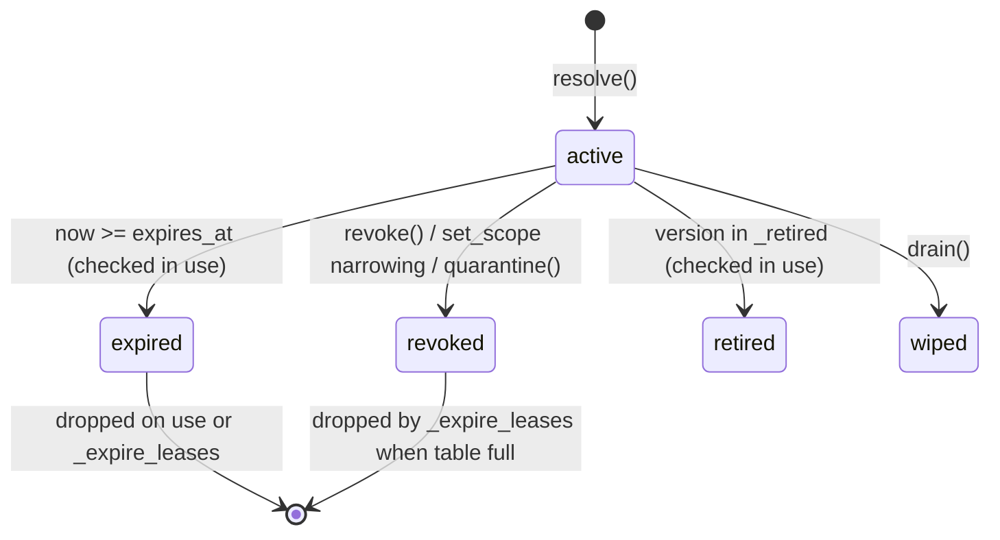
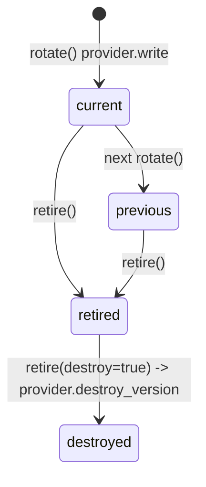

# Lifecycle state machines

| ID | INV55-ARCH-LIFECYCLE | Version | 4.3.0 | Status | Draft |
|---|---|---|---|---|---|

## Service state (`service.py::State`, `service.py::TRANSITIONS`)

Rules (from code):

- `transition` MUST reject any edge not in `TRANSITIONS` (`ValueError`).
- Requests are served only in `ready` and `degraded`; all other states return `FROZEN` (`_guard`).
- Leaving `quarantined` requires `freeze()` then `unfreeze()` by a principal with role `operator`.
- `quarantine()` marks every lease revoked. `drain()` wipes lease values and clears leases and cache.
- Every transition increments `inv55_state_transitions_total{to}` and logs `state_transition`.
- Automatic quarantine is wired for one trigger only: audit-chain divergence at boot (`bootstrap.py::build_service` → `transition(QUARANTINED, "audit_chain_divergence")` when `audit.resume_from_file` raises). Runtime divergence detection is NOT IMPLEMENTED.
- `health()` reports `ready=true` in `ready`/`degraded` unless stalled (`in_flight > 0` and no progress for `stall_after_s`=30 s).

## Lease lifecycle (`service.py::Lease`)

- TTL = `ttl_s` (default `lease_ttl_s`=300) capped at `max_lease_ttl_s`=3600; MUST be finite and > 0.
- Leases are bound to tenant, subject, name and version; mismatch → CONTEXT_MISMATCH. A `secret-admin` may revoke another subject's lease (audited `revoked_by_admin`).
- Expired/dropped leases are not wiped (value shared with cache; WVR-037).
- Revoked leases are not proactively removed; they are purged only when the lease table reaches `max_active_leases`.
- Leases are in memory only by design; they do not survive restart (crash-restart-semantics.md).

## Version lifecycle

- Rotation appends a version; existing leases keep their version (`rotate` only invalidates the local cache).
- Retirement is recorded in `_retired` and, when `state_path` is set, persisted atomically (`_save_state`) and reloaded at init; `bootstrap.py` always sets `state_path`. It is NOT propagated to other instances; use `destroy=true` for cluster-wide effect.

## Change history

| Version | Date | Change |
|---|---|---|
| 4.3.0 | 2026-09-22 | Initial draft |
| 4.3.0 | 2026-09-23 | Admin revoke; wipe gap |
| 4.3.0 | 2026-09-22 | Boot-time audit quarantine; persisted retirements |
