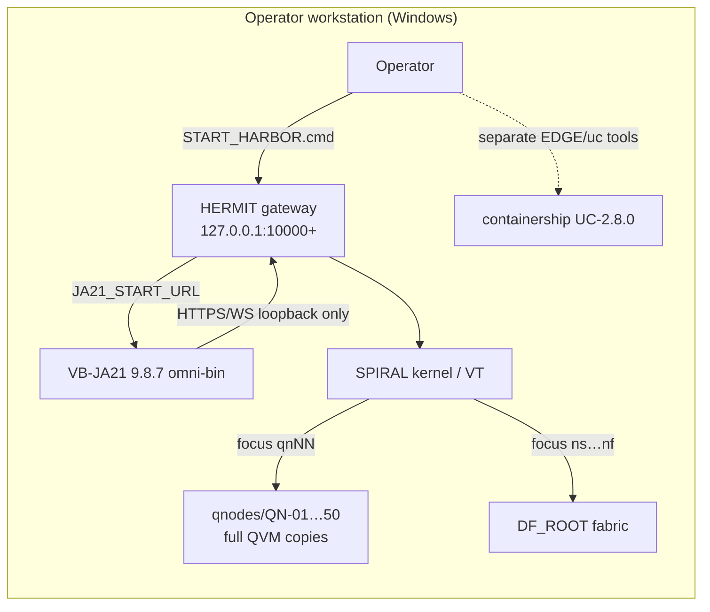
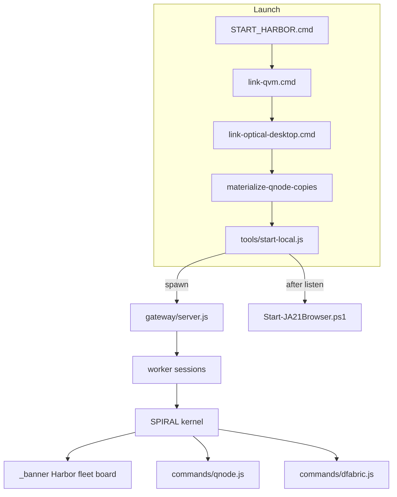
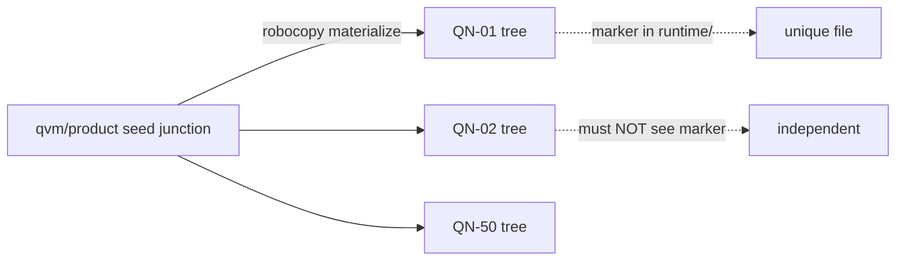
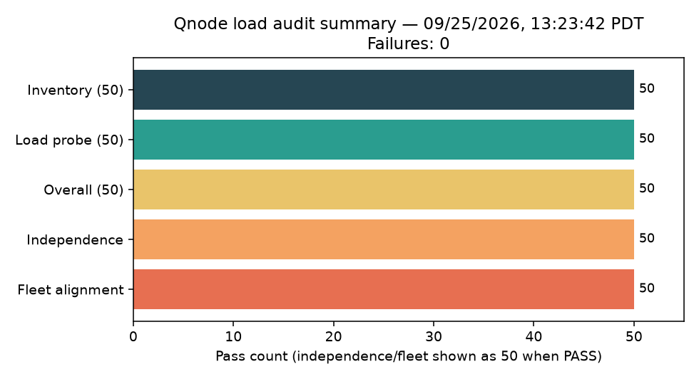
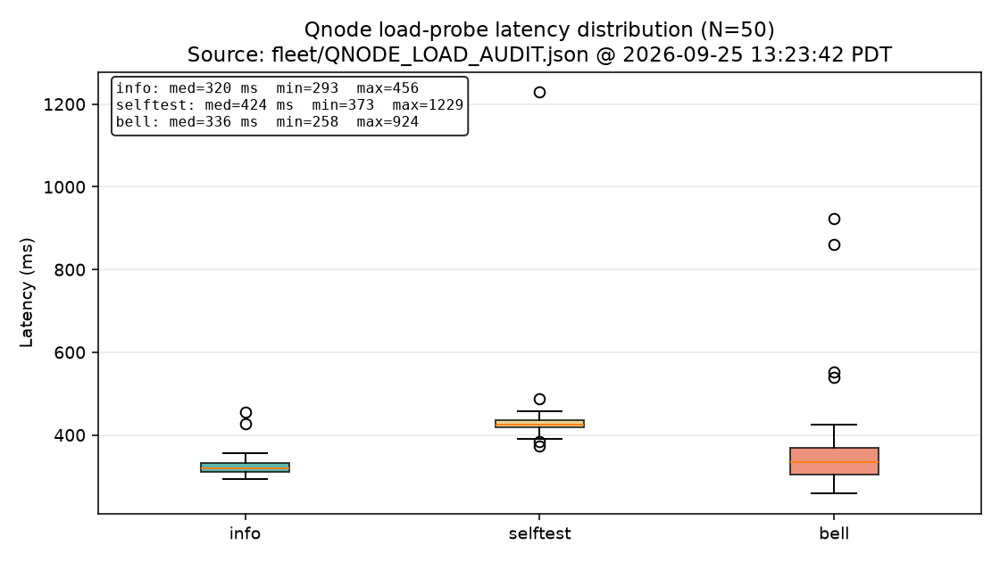
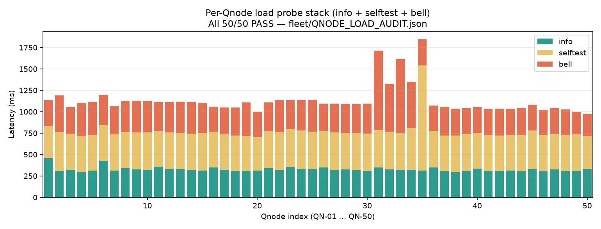
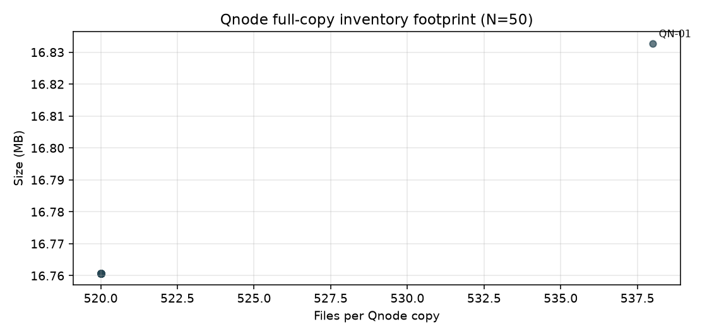

# Harbor Bridge Terminal Platform — Technical Expository Note

| Field | Value |
|-------|-------|
| **Document** | Harbor Bridge Terminal Technical Note |
| **Version** | 1.1 (Product Preview) |
| **Date** | 2026-09-25 (America/Los_Angeles / PT) |
| **Classification** | Product Preview — Tester evaluation |
| **Authors / Attribution** | David Paul Russell / Russell Philip Smithson (LK/Vexa, Linear Finance) |
| **Repository** | https://github.com/LKVexa/Harbor-Bridge-Terminal |
| **License** | Product Preview Tester License 1.0 (root `LICENSE`) |
| **Companion artifacts** | `docs/figures/`, `docs/verification/`, `fleet/QNODE_LOAD_AUDIT.*` |

---

## 1. Abstract / executive technical summary

**Harbor Bridge Terminal** is a combined local workspace that collocates five operational surfaces under one operator launch path:

1. **Unikernel Containership UC-2.8.0** (`containership/`) — edge-atom shipyard for berths, hull, verify, and fabric ticks.
2. **HERMIT / SPIRAL bridge-terminal** (`bridge-terminal/`, package `hermit-spiral-terminal` **2.0.0-ramws.1**) — virtual terminal + RAM-resident virtual WebSocket (RAMWS) gateway on loopback.
3. **50× full-copy QVM Qnodes** (`qnodes/QN-01`…`QN-50`) — independent QVM **8.1.0-alpha** product trees with Harbor `IDENTITY.json` / `QNODE.cmd`.
4. **DF fabric focus surface** — containers `ns` / `nm` / `nl` / `nx` / `nf` bound via `DF_ROOT`.
5. **VB-JA21 Portable Optical Desktop 9.8.7** (`optical-desktop/`) — Harbor browser (omni-bin); **not** the system default browser.

The primary operator entry is `START_HARBOR.cmd` → `bridge-terminal/tools/start-local.js`, which mints (or reuses) a loopback access token, binds fleet roots, starts `gateway/server.js` on `127.0.0.1` (preferred port **10000**, auto-advancing if busy), then launches JA21 with `JA21_START_URL` and `JA21_ALLOW_PRIVATE_HOSTS=1`.

**Verification posture (honest):** On 2026-09-25 PT a full Qnode load audit recorded **50/50** inventory + load-carry passes (`fleet/QNODE_LOAD_AUDIT.*`). This note’s verification chapters **re-ran** presence, inventory, independence, fleet alignment, start-path dry checks, a **3-node load spot-check (9/9)**, a **bridge unit subset (30/30)**, and a **live SPIRAL/landing HTTP + WebSocket-admission probe** on a controlled `--no-browser` gateway (see §13). It does **not** invent trading PnL, Sharpe ratios, or synthetic throughput. Where a class of result does not exist (market backtester), we define **“backtesting”** as **historical / regression verification** of platform behaviors against the fixed fleet snapshot.

---

## 2. Scope, non-goals, and licensing posture

### 2.1 In scope

- Architecture of the Harbor integration layer (layout, launchers, fleet binding, SPIRAL focus codes, optical desktop start URL).
- Data model for `fleet/HARBOR_FLEET.json` and `qnodes/FLEET.json` under `qnode_mode=full-copies`.
- Security of local access tokens and public-repo gitignore constraints.
- Measured verification of Qnode load-carrying and configuration regressions that actually exist in-tree.

### 2.2 Non-goals

- Production certification, SLAs, or multi-tenant hosted deployment.
- Physical QPU execution (QVM policy: `physical_qpu_execution: false`, local simulation only).
- Market / trading strategy backtests, PnL curves, or fabricated performance metrics.
- Modifying upstream QVM, DF archive, or Downloads JA21 portable **in place** (Harbor uses junctions / copies).

### 2.3 Licensing

Root `LICENSE` is the **Product Preview Tester License** (evaluation / tester feedback only; not OSI open-source; not a production grant). Copyright © 2026 David Paul Russell / Russell Philip Smithson (LK/Vexa, Linear Finance). Component trees retain their own notices (`containership/LICENSE`, `bridge-terminal/LICENSE`, JA21 portable licensing when linked).

---

## 3. System context and threat / deployment model



| Property | Harbor posture |
|----------|----------------|
| Bind address | `VWS_HOST=127.0.0.1` only (start-local) |
| Auth | Operator principal; access token SHA-256 in `.vws-local/principals.json`; plaintext only in local gitignored `ACCESS_TOKEN.txt` |
| Browser | JA21 with private-host allow; system browser deliberately unused |
| Secrets on GitHub | **None** — public repo; tokens and principals gitignored |
| Threat model (preview) | Local evaluator machine; not hardened for adversarial remote clients |

---

## 4. Architecture overview

Harbor is a **layered composition**, not a monolith rewrite:

| Layer | Path | Role |
|-------|------|------|
| Containership | `containership/` | UC-2.8.0 edge atoms; `uc.py` / `EDGE.cmd` ship battery |
| Bridge / RAMWS | `bridge-terminal/gateway`, `ram/`, `protocol/` | Loopback virtual WebSocket gateway, byte credits, ledger |
| SPIRAL | `bridge-terminal/src/main/spiral/` | In-process shell: VFS, registry, pipeline, landing banner |
| Qnode fleet | `qnodes/`, `…/spiral/qnodes/` | Locator + runner over 50 full copies |
| DF fabric | `…/spiral/dfabric/`, `…/commands/dfabric.js` | Locator + CLI child processes |
| Optical desktop | `optical-desktop/` | Junction to JA21 portable; start URL contract |
| Harbor glue | `START_HARBOR*.cmd`, `scripts/*`, `fleet/*` | Bind, materialize, audit, document |



---

## 5. Component deep-dives

### 5.1 Unikernel Containership UC-2.8.0

- **Version file:** `containership/VERSION` → `2.8.0`.
- **Surface:** `uc.py` subcommands (`status`, `build`, `verify`, `run`, `fabric`, `edge`, …); Windows launchers `EDGE.cmd`, `VERIFY.cmd`, `START.cmd`, etc.
- **Architecture pointer:** `containership/ARCHITECTURE.md` defers to `docs/vws/ARCHITECTURE.md`.
- **EDGE status (recorded evidence, not re-pytested in this session):** `EDGE.cmd status` reports schema `UC/EDGE_STATUS/1`, candidate `UC-2.8.0`, **86** elements/atoms, evidence totals **9833** passed / **41** failed / **46** skipped, verdicts **59** `SUITE_GREEN` / **27** `SUITE_RED` (from `edge/evidence/EDGE_TEST_RESULTS.json`; host recorded as Linux pytest). Captured: `docs/verification/containership-edge-summary.json`.

### 5.2 HERMIT / SPIRAL / RAMWS bridge-terminal

- **Package:** `hermit-spiral-terminal` `2.0.0-ramws.1` (`bridge-terminal/package.json`).
- **Desktop:** Electron HERMIT (`npm start`) with VT engine + SPIRAL backend under `src/main/spiral/`.
- **Gateway profile used by Harbor:** `node gateway/server.js` via `start-local.js` with `LOCAL_VOLATILE` constraints — **must not** set `VWS_SNAPSHOTS` / `VWS_SNAPSHOT_DIR` (ConfigError); start-local explicitly `delete`s those env keys (fix in commit `d7ec680a`).
- **Protocol / RAM:** `protocol/`, `ram/` (descriptor, ledger, residency, traffic), tests under `tests/protocol`, `tests/ram`, `tests/gateway`.
- **Landing / locator / runner:**
  - Landing banner: `SpiralKernel._banner` in `kernel.js` (lines ~303–386) prints **Harbor fleet board** (DF rows + 5×10 Qnode grid).
  - Qnode locator: `src/main/spiral/qnodes/locator.js` (`COUNT=50`, full-copy operable = IDENTITY + local `qvm/cli.py` + `VERSION`).
  - Qnode runner: `src/main/spiral/qnodes/runner.js` (invoked from focus commands).
  - Commands: `commands/qnode.js` registers `qn`/`qnode`, `__hf__` dispatcher, `qn01`…`qn50`, and DF shorts `ns`…`nf`.

### 5.3 Qnode fleet (50 full copies)

Each `qnodes/QN-XX/` is a **complete independent** QVM tree (not a thin shared junction at runtime):

| Artifact | Purpose |
|----------|---------|
| `qvm/`, `examples/`, `PHOTON/`, `RUN_QVM.cmd`, `VERSION` | Product copy (gitignored bulk) |
| `IDENTITY.json` | Harbor id/code/index/product (`copy: true`) |
| `QNODE.cmd` | Sets `PYTHONPATH` to **that** copy root; runs `py -3 -m qvm.cli` |
| `runtime/` | Per-node caches (gitignored except `.gitkeep`) |

**Materialization:** `scripts/materialize-qnode-copies.cmd` / `.js` robocopies from `qvm/product` seed (junction via `scripts/link-qvm.cmd` + `qvm/PRODUCT_LINK.txt`). `START_HARBOR.cmd` materializes if `QN-01\qvm\cli.py` is missing.

**QVM policy (from audited `qvm.cli info` stdout):** local simulation; network deny; max 20 qubits; backends include `statevector`, `density-matrix`, `stabilizer`, etc.; `physical_hardware: false`.

### 5.4 DF fabric focus

Codes from `fleet/HARBOR_FLEET.json` and `commands/qnode.js` `DF_FOCUS`:

| Code | Kind | ID | Dir |
|------|------|----|-----|
| `ns` | df-node | N_SMALL | DF_Small |
| `nm` | df-node | N_MEDIUM | DF_Medium |
| `nl` | df-node | N_LARGE | DF_Large |
| `nx` | df-node | N_XLARGE | DF_Xtra_Large |
| `nf` | df-fabric | DF_Fabric | DF_Fabric |

Bound when `DF_ROOT` points at the folder containing `DF_Fabric/adapter/dfabric/cli.py` (Desktop `New folder` discovery in `START_HARBOR.cmd` / start-local).

### 5.5 Optical desktop (VB-JA21 9.8.7)

- `optical-desktop/PRODUCT_LINK.txt` → Downloads portable root; `VERSION` = `9.8.7`.
- Junction `optical-desktop/portable/` (gitignored bulk ~800 MB).
- Launch contract: env `JA21_START_URL` and/or `-StartUrl`; Harbor sets `JA21_ALLOW_PRIVATE_HOSTS=1` so `127.0.0.1` is permitted (commit `55cf1a7f`).
- `START_HARBOR_BROWSER.cmd` probes ports `10000`–`10019` if no URL given.

---

## 6. Data / fleet model

### 6.1 `fleet/HARBOR_FLEET.json`

- `version`: 2  
- `generated`: `2026-09-25T20:02:06.724Z`  
- `qnode_mode`: **`full-copies`**  
- `df_containers`: 5 entries (`ns`…`nf`)  
- `qnodes`: 50 entries `qn01`…`qn50` with `copy: true`, product `QVM 8.1.0-alpha`

### 6.2 `qnodes/FLEET.json`

Roster twin: `count: 50`, `mode: full-copies`, `seed_link` / `seed_junction`, per-node `operable_hint`: `IDENTITY + local qvm/cli.py + VERSION`.

### 6.3 Full-copies design rationale

Commit `b256b3c0` converted thin shared instances to **50 independent trees** so runtime does not depend on `qvm/product` junction; the junction remains only for rematerialize. Independence is verified by writing a marker under `QN-01/runtime` and confirming absence under `QN-02/runtime`.

---

### 6.4 `fleet/MOBILE_PLATFORM.json`

Records VM substrate, iOS/Android Bottle Rocket app nodes, RODEO sidecar binding, and the reproducible compiler / `on-mobile-auth` contract. Junction targets are not inventoried as git content.

## 7. Operator surface

### 7.1 Focus command codes

| Code | Target |
|------|--------|
| `qn01` … `qn50` | Enter Qnode focus REPL (or `qn attach qn07`) |
| `ns` `nm` `nl` `nx` `nf` | DF container / fabric focus |
| `qn status` / `qn where` / `qn list` | Fleet board / paths |
| `exit` / `detach` | Leave focus (`__hf__`) |

While focused, Qnode subs: `info`, `capabilities`, `resources`, `run`, `bell`, `selftest`, `status`, `where`. DF subs: `status`, `build`, `verify`, `run`, `where`, `doctor`, `attest`.

### 7.2 START_HARBOR flow

```mermaid
sequenceDiagram
  participant U as Operator
  participant SH as START_HARBOR.cmd
  participant SL as start-local.js
  participant GW as gateway/server.js
  participant JA as JA21 Portable
  U->>SH: double-click / cmd
  SH->>SH: set DF_ROOT, QNODE_ROOT, HARBOR_ROOT
  SH->>SH: link-qvm / link-optical-desktop
  SH->>SH: materialize if QN-01 missing cli.py
  SH->>SL: node tools/start-local.js
  SL->>SL: mint principals + ACCESS_TOKEN.txt (first run)
  SL->>SL: pickPort(10000..+19); delete VWS_SNAPSHOTS*
  SL->>GW: spawn with PORT, VWS_HOST=127.0.0.1
  SL->>SL: waitForListen
  SL->>JA: Start-JA21Browser.ps1 -StartUrl http://127.0.0.1:PORT/
  Note over JA: JA21_ALLOW_PRIVATE_HOSTS=1
```

Flags: `--no-browser`, `--no-fabric`, `--port N`, `--reuse`.

### 7.3 Sign-in

Paste contents of local `ACCESS_TOKEN.txt` into the JA21 sign-in box. Lost token: delete `bridge-terminal/.vws-local/principals.json` and `ACCESS_TOKEN.txt`, then restart.

---

## 8. Security and secrets

| Control | Implementation |
|---------|----------------|
| Public repo | https://github.com/LKVexa/Harbor-Bridge-Terminal — **no live tokens** |
| `.gitignore` | `ACCESS_TOKEN.txt`, `bridge-terminal/.vws-local/`, `qnodes/QN-*/**` bulk (keep IDENTITY/QNODE.cmd), `optical-desktop/portable/` |
| Token storage | Plaintext local file + one-time console print; on disk principal store keeps **SHA-256 only** |
| Network | Loopback bind; JA21 private-host gate opened only for Harbor launch |
| QVM | Network deny / no plugins / no physical hardware in default policy |

**Session check (2026-09-25 ~13:28 PT):** `ACCESS_TOKEN.txt` and `principals.json` are **not** tracked by git; gitignore patterns present (`docs/verification/secrets-gitignore.json`).

---

## 9. Figures

### 9.1 Mermaid — Qnode independence



### 9.2 Charts from measured audit JSON

All PNGs generated from `fleet/QNODE_LOAD_AUDIT.json` (date **09/25/2026, 13:23:42 PDT**) via `docs/figures/_gen_audit_charts.py` — **no invented series**.



**Figure 9.2-a.** Pass counts from the recorded audit (inventory / load / overall = 50; independence & fleet alignment shown as 50 when PASS).



**Figure 9.2-b.** Load-probe latency distributions (info / selftest / bell), N=50.



**Figure 9.2-c.** Per-node stacked probe times (QN-01…QN-50).



**Figure 9.2-d.** Files vs size: mode **520** files / ~16.8 MB; QN-01 slightly higher file count (**538**) due to extra runtime artifacts at audit time.

### 9.3 Timing statistics (from audit JSON)

| Probe | min (ms) | median (ms) | mean (ms) | max (ms) |
|-------|---------:|------------:|----------:|---------:|
| info | 293 | 319.5 | 326.2 | 456 |
| selftest | 373 | 424.5 | 442.2 | 1229 |
| bell | 258 | 335.5 | 363.0 | 924 |

Source: `docs/verification/audit-timing-stats.json`. Each selftest run reported **35** unit tests OK (from QN-01 audit stdout).

---

## 10. Test and verification program

### 10.1 Methodology

| Class | Method | Honesty rule |
|-------|--------|--------------|
| Inventory | Key files + file/byte counts + non-reparse | From disk / audit script |
| Independence | Marker under QN-01/runtime ∉ QN-02/runtime | Pass/fail only |
| Load probe | `qvm.cli info`, `selftest`, `run examples/bell.json` | Exit codes + measured ms |
| Fleet align | `HARBOR_FLEET.json` codes vs dirs | Structural |
| Start-path dry | `node --check`, static presence of snapshot/port/JA21 fixes | No live gateway required |
| Bridge units | `node --test` on selected files | Real TAP counts |
| Historical audit | Cite `QNODE_LOAD_AUDIT.*` with date | Do not fabricate second full audit |

**Full 50-node audit was not re-executed** in the documentation session because it had already completed the same afternoon (13:23:42 PDT). Instead: cite prior audit + re-run inventory/independence/alignment + **spot-check** QN-01, QN-25, QN-50.

### 10.2 Session probes (2026-09-25 ~13:28–13:30 PT)

| Probe | Result | Artifact |
|-------|--------|----------|
| Script / launcher presence | **21/21** present | `docs/verification/script-presence.json` |
| Fleet inventory keys (50) | **50/50** ok | `docs/verification/fleet-inventory-spotcheck.json` |
| Independence marker | **PASS** | `docs/verification/independence.json` |
| Fleet alignment | **PASS** (`full-copies`, 50, df `ns,nm,nl,nx,nf`) | `docs/verification/fleet-alignment.json` |
| start-local dry | syntax OK; deletes `VWS_SNAPSHOTS`; `pickPort`; sets `JA21_ALLOW_PRIVATE_HOSTS` | `docs/verification/start-local-dry.json` |
| Secrets / gitignore | patterns OK; token & principals untracked | `docs/verification/secrets-gitignore.json` |
| Load spot-check | **9/9 PASS** (see §13) | `docs/verification/load-spotcheck.json` |
| Bridge unit subset | **30/30 PASS** in 192.5 ms | `docs/verification/bridge-unit-subset.txt` |
| Optical desktop link | start cmd + ps1 **present** | `docs/verification/optical-desktop-link.json` |
| Containership EDGE status | cited recorded evidence (59 green / 27 red atoms) | `docs/verification/containership-edge-summary.json` |
| SPIRAL/landing HTTP+WS (later same day) | **PASS** controlled gateway `:10003` — see §13 | `docs/verification/spiral-landing/` |

Consolidated: `docs/verification/SESSION_VERIFICATION_SUMMARY.json`.

---

## 11. “Backtesting” / historical verification

### 11.1 Definition (explicit)

Harbor Bridge Terminal **does not** include a market or trading backtester. In this monograph, **backtesting** means:

> **Replay / regression verification** of platform behaviors against a fixed fleet snapshot and recorded audits — including Qnode load-audit replay semantics, CLI selftests, configuration regression of the start path, and comparison of spot-checks to the prior full audit.

### 11.2 Historical defect → fix narrative (start path)

| Commit | Date (author TZ) | Change |
|--------|------------------|--------|
| `d7ec680a` | 2026-09-25 13:09:49 -0700 | **Fix START_HARBOR crash:** drop `LOCAL_VOLATILE`-incompatible snapshots (`delete env.VWS_SNAPSHOTS` / `VWS_SNAPSHOT_DIR`); auto-pick free loopback port; pause on error in `START_HARBOR.cmd` |
| `93775d40` | (same day lineage) | Document / persist `ACCESS_TOKEN.txt` locally (gitignored) |
| `e270ddc0` | | Integrate JA21 as Harbor browser with start URL |
| `55cf1a7f` | | Set `JA21_ALLOW_PRIVATE_HOSTS=1` for loopback |
| `b256b3c0` | | Convert Qnodes to 50 full copies |
| `d68fc5bf` | | Document Qnode load audit 50/50 |

**Regression check (session):** start-local still contains snapshot deletion, `pickPort`, and JA21 private-host allow — dry verification **PASS**.

### 11.3 Audit stability

Only **one** machine-readable full audit artifact is present (`fleet/QNODE_LOAD_AUDIT.json`, 13:23:42 PDT). Pass rate: **50/50** overall. Session spot-check on three nodes **agrees** (all probes exit 0). There is **no** multi-day audit time series yet; future audits should append dated JSON rather than overwrite if trend analysis is desired.

### 11.4 QVM selftest as historical unit replay

Each node’s `qvm.cli selftest` re-runs the packaged unit suite (35 tests in audited stdout). That is the closest in-tree analogue to “replayable historical verification” of quantum-VM correctness claims (Bell exact, teleportation, security quotas, etc.) — still **local simulation**, not hardware.

---

## 12. Results (honest tables)

### 12.1 Prior full Qnode load audit (cited)

| Check | Result |
|-------|--------|
| Date (PT) | 09/25/2026, 13:23:42 PDT |
| Parallelism | 5 |
| Inventory | **50 / 50** |
| Load probe | **50 / 50** |
| Overall carry-load | **50 / 50** |
| Independence | PASS |
| Fleet alignment | PASS |
| Failures | none |

### 12.2 Session load spot-check (measured)

| Node | info | selftest | bell |
|------|------|----------|------|
| QN-01 | PASS 314 ms | PASS 329 ms | PASS 284 ms |
| QN-25 | PASS 249 ms | PASS 312 ms | PASS 252 ms |
| QN-50 | PASS 250 ms | PASS 337 ms | PASS 296 ms |

All exit codes **0**.

### 12.3 Bridge unit subset (measured)

`node --test tests/protocol/bridge.test.js tests/protocol/codec.test.js tests/ram/descriptor.test.js tests/ram/ledger.test.js tests/gateway/config.test.js`

| Metric | Value |
|--------|------:|
| tests | 30 |
| pass | 30 |
| fail | 0 |
| duration_ms | 192.4684 |

### 12.4 Containership EDGE (recorded evidence cited)

| Metric | Value |
|--------|------:|
| atoms / elements | 86 |
| SUITE_GREEN | 59 |
| SUITE_RED | 27 |
| tests_passed_sum | 9833 |
| tests_failed_sum | 41 |

**Note:** These totals come from stored EDGE evidence, not a fresh full pytest in this documentation session.

---

## 13. SPIRAL / landing verification

### 13.1 What "landing" means in Harbor

Harbor's operator landing is two layers:

1. **HTTP landing page** — static HERMIT web client (`bridge-terminal/web/index.html`) served by `gateway/server.js` at `http://127.0.0.1:<port>/` (sign-in shell + terminal surface). Public JSON: `/health`, `/live`, `/config.json`.
2. **SPIRAL session banner** — after authenticated WebSocket upgrade (`/ws/terminal`, subprotocol `hermit.vws.v2`) and session open, `SpiralKernel._banner` prints the **Harbor fleet board**: DF rows (`ns`/`nm`/`nl`/`nx`/`nf`) with OPERABILITY + RUNTIME, then **Qnodes** `operable/count` and a 5×10 `qnNN` grid (`kernel.js` ~303–386). Focus shorts are registered in `commands/qnode.js` (loop `qn01`…`qn50` + `DF_FOCUS`).

The fleet board is **not** embedded in the static HTML; HTTP alone cannot show operable counts. Operability for documentation was therefore measured by running the **same** `QnodeLocator` / `DFLocator` classes the banner uses, plus live HTTP/WS admission against a running gateway.

### 13.2 Methodology (2026-09-25 ~13:35–13:40 PT)

| Step | Action | Honesty rule |
|------|--------|--------------|
| Port survey | `Get-NetTCPConnection` on `127.0.0.1:10000`–`10019` | Record owners; do not invent listeners |
| Attach vs start | Pre-existing Harbor on **10001** and **10002**; non-Harbor hermit on **10000** | Prefer Harbor instances; avoid killing operator sessions |
| Controlled start | `node tools/start-local.js --no-browser --port 10003` | Skip JA21 UI; bind `QNODE_ROOT` + `DF_ROOT` |
| HTTP probes | `Invoke-WebRequest` `/`, `/health`, `/live`, `/config.json`, CSS, `/index.html` | Record status, bytes, ms |
| Ticket API | `POST /api/ws-ticket` Bearer vs no-auth | Redact token/ticket values in artifacts |
| WS admission | Raw upgrade with `Sec-WebSocket-Protocol: hermit.vws.v2` | Cookie+Origin and Bearer+no-Origin → expect **101** |
| Fleet board | Node script requiring locator modules | Same OPERABILITY/RUNTIME fields as `_banner` |
| Focus codes | Structural scan of `commands/qnode.js` | Loop registration for 50 Qnode shorts + DF keys |
| Cleanup | Stopped probe start-local + gateway PIDs | Left **10000/10001/10002** running |

Raw evidence: `docs/verification/spiral-landing/` (see `COMMAND_LOG.md`, `SPIRAL_LANDING_VERIFICATION_SUMMARY.json`).

### 13.3 Results — HTTP / config (port **10003**, controlled start)

| Path | HTTP | ms | bytes | Pass |
|------|-----:|---:|------:|:----:|
| `/` | 200 | 50 | 7906 | yes |
| `/health` | 200 | 17 | 15 | yes (`{"status":"ok"}`) |
| `/live` | 200 | 14 | 2297 | yes (profile `LOCAL_VOLATILE`) |
| `/config.json` | 200 | 19 | 269 | yes (`protocol: hermit.vws.v2`, `capabilities.fabric: true`) |
| `/styles.css` | 200 | 24 | 11804 | yes |
| `/web.css` | 200 | 16 | 2271 | yes |
| `/index.html` | 200 | 25 | 7906 | yes |

Landing HTML title observed: **HERMIT — virtual WebSocket terminal**; sign-in / terminal surface markers present (`port10003-html-markers.json`).

Pre-existing Harbor **10001** / **10002** also returned `/health` **200** and `/config.json` with `fabric: true` (spot-checked; artifacts under `port10001_*` / `port10002_*`).

### 13.4 Results — auth + WebSocket admission (10003)

| Probe | Result |
|-------|--------|
| `POST /api/ws-ticket` + Bearer | **200**, `Set-Cookie` `vws_ticket` Path=`/ws/terminal`, body `expiresInMs` (ticket value redacted) |
| `POST /api/ws-ticket` no auth | **401** (expected) |
| WS upgrade Cookie + `Origin: http://127.0.0.1:10003` | **101** Switching Protocols |
| WS upgrade Bearer + no Origin (`VWS_ALLOW_NO_ORIGIN`) | **101** Switching Protocols |

Full VT banner text over the wire was **not** decoded (would require completing the `hermit.vws.v2` session-open handshake after upgrade). Admission to the SPIRAL transport path is verified; interactive banner rendering remains an optional JA21 check (§14).

### 13.5 Results — fleet board fields (locator = banner logic)

Measured via `QnodeLocator` + `DFLocator` with `HARBOR_ROOT` / `QNODE_ROOT` / `DF_ROOT` matching start-local (28 ms):

| Surface | Code | Operability | Runtime |
|---------|------|-------------|---------|
| DF node | `ns` | not built | present |
| DF node | `nm` | not built | present |
| DF node | `nl` | not built | present |
| DF node | `nx` | not built | present |
| DF fabric | `nf` | present | fabric |
| Qnodes | `qn01`…`qn50` | **50/50 operable** | QVM **8.1.0-alpha** full-copies |

Focus registration (source): loop builds `qn01`…`qn50` shorts; `DF_FOCUS` keys `ns`/`nm`/`nl`/`nx`/`nf` present — **PASS** (`fleet-board-locator.json`).

### 13.6 Harbor process lifecycle this session

| Action | Detail |
|--------|--------|
| Started | `start-local.js --no-browser --port 10003` (parent + `gateway/server.js` child) |
| Stopped | Yes — probe PIDs terminated after probes; **10003** no longer listening |
| Left running | Pre-existing **10000** (other hermit), Harbor **10001**, Harbor **10002** |

### 13.7 Residual gaps (SPIRAL-specific)

- JA21 omni-window interactive sign-in and visual confirmation of the fleet board
- End-to-end decode of SPIRAL banner VT bytes after session-open
- DF node **build** / **verify** (dirs present; operability "not built")

---

## 14. Limitations, deferred verification, and skipped work

### 14.1 Known platform gaps

| Gap | Notes |
|-----|-------|
| DF fabric live build/verify | `DF_ROOT` bound; nodes **present** but **not built** (see §13.5); not asserted green |
| Multi-audit trend | Only one full audit JSON snapshot exists |
| JA21 bulk not in git | Requires Downloads portable + `link-optical-desktop.cmd` |
| Preview license | Not production; no warranty |

### 14.2 Deferred verification / skipped work (prior documentation session + residual)

These items were **explicitly skipped** (or only partially covered) so readers are not misled. Rationale and how to run later:

| Skipped item | Why skipped | How a reader can run later |
|--------------|-------------|----------------------------|
| Full `scripts/audit-qnode-load` re-run of all 50 | Same-day full audit already green (`fleet/QNODE_LOAD_AUDIT.*`, 13:23:42 PDT); session used inventory + **3-node spot-check** | `scripts\audit-qnode-load.cmd` (set `QNODE_AUDIT_PARALLEL` if desired) |
| Live `START_HARBOR` + JA21 interactive session / live SPIRAL landing UI | Long-lived optical desktop UI; interactive sign-in | `START_HARBOR.cmd` (or `START_HARBOR.cmd --no-browser` then `START_HARBOR_BROWSER.cmd`); paste `ACCESS_TOKEN.txt` |
| Full `npm test` / chaos / fabric e2e | Long runtime; some suites need services | `cd bridge-terminal && npm test` (see `bridge-terminal/package.json` scripts) |
| `uc.py verify --quick` full battery | EDGE recorded evidence cited instead of fresh pytest | `cd containership && uc.py verify --quick --no-hull` or `VERIFY.cmd` / `EDGE.cmd` |
| PDF/HTML export of this note | Optional; markdown is primary | Any Pandoc/Markdown toolchain against this file |
| `bridge-terminal/package-lock.json` left untracked | Created as `npm install` side-effect; lockfile policy still open for Electron desktop | Decide deliberately whether to commit after a clean `npm install` |

**Partial coverage this revision:** HTTP landing + WS admission + locator fleet board (§13) **were** run. Remaining SPIRAL UI gap is JA21 visual / full session-open banner decode (§13.7).

**Future work (suggested):** dated audit append; CI job for inventory+spot-check+HTTP `/health`; optional hermetic DF fixture; document EDGE_RED atom triage; optional session-open banner capture harness.

---

## 15. References

| Ref | Location |
|-----|----------|
| GitHub | https://github.com/LKVexa/Harbor-Bridge-Terminal |
| License | `LICENSE` |
| README | `README.md` |
| Fleet model | `fleet/HARBOR_FLEET.json`, `qnodes/FLEET.json` |
| Load audit | `fleet/QNODE_LOAD_AUDIT.md`, `.json` |
| Start path | `START_HARBOR.cmd`, `bridge-terminal/tools/start-local.js` |
| SPIRAL Qnode cmds | `bridge-terminal/src/main/spiral/commands/qnode.js` |
| Landing banner | `bridge-terminal/src/main/spiral/kernel.js` (`_banner`) |
| Locator | `bridge-terminal/src/main/spiral/qnodes/locator.js` |
| Audit script | `scripts/audit-qnode-load.js` |
| This note’s figures | `docs/figures/` |
| This note’s verification | `docs/verification/` |
| SPIRAL/landing probes | `docs/verification/spiral-landing/` |
| Containership | `containership/README_START_HERE.md`, `ARCHITECTURE.md` |
| Bridge README | `bridge-terminal/README.md` |
| Bridge SECURITY | `bridge-terminal/docs/SECURITY.md`, `docs/RAMWS.md` |

---

## Appendix A — Command cheat sheet

```bat
START_HARBOR.cmd
START_HARBOR.cmd --no-browser
START_HARBOR_BROWSER.cmd
START_HARBOR_BROWSER.cmd http://127.0.0.1:10001/
scripts\link-optical-desktop.cmd
scripts\link-qvm.cmd
scripts\materialize-qnode-copies.cmd
scripts\audit-qnode-load.cmd
cd containership && EDGE.cmd status
cd containership && uc.py verify --quick --no-hull
cd bridge-terminal && npm test
cd qnodes\QN-07 && QNODE.cmd info
cd qnodes\QN-07 && QNODE.cmd selftest
cd qnodes\QN-07 && QNODE.cmd run examples\bell.json
```

Inside SPIRAL (after sign-in): `qn status`, `qn07`, `bell`, `ns`, `fabric status`, `help`, `exit`.

## Appendix B — Focus codes

| Code | Target |
|------|--------|
| qn01…qn50 | QN-01…QN-50 |
| ns nm nl nx | DF_Small/Medium/Large/Xtra_Large |
| nf | DF_Fabric |

## Appendix C — Environment variables

| Variable | Role |
|----------|------|
| `HARBOR_ROOT` | Harbor workspace root |
| `QNODE_ROOT` | Directory holding QN-01…QN-50 |
| `DF_ROOT` | Folder containing DF_Fabric + node dirs |
| `PORT` / `--port` | Preferred gateway port |
| `HARBOR_NO_BROWSER` / `--no-browser` | Skip JA21 |
| `HARBOR_REUSE` / `--reuse` | Reuse existing listener |
| `JA21_START_URL` | Omni-bin start navigation |
| `JA21_ALLOW_PRIVATE_HOSTS` | Allow 127.0.0.1 in JA21 |
| `VWS_HOST` | Gateway bind (127.0.0.1) |
| `VWS_PRINCIPALS_FILE` | Principals JSON path |
| `VWS_FABRIC` | `1` when DF bound |
| `VWS_SNAPSHOTS` / `VWS_SNAPSHOT_DIR` | **Must be unset** for LOCAL_VOLATILE |
| `QNODE_AUDIT_PARALLEL` | Audit concurrency (default 5) |
| `PYTHONPATH` | Set to Qnode copy root when invoking qvm.cli |

## Appendix D — Document control

| Item | Value |
|------|-------|
| Generated | 2026-09-25 PT |
| SPIRAL landing probes | 2026-09-25 ~13:35–13:40 PT; artifacts `docs/verification/spiral-landing/` |
| HEAD at authoring start | `2824d2ad` (technical note v1.0); SPIRAL chapter added in v1.1 |
| Metrics policy | No invented statistics; N/A stated where absent |

---

*End of Harbor Bridge Terminal Technical Note v1.1 (Product Preview).*
